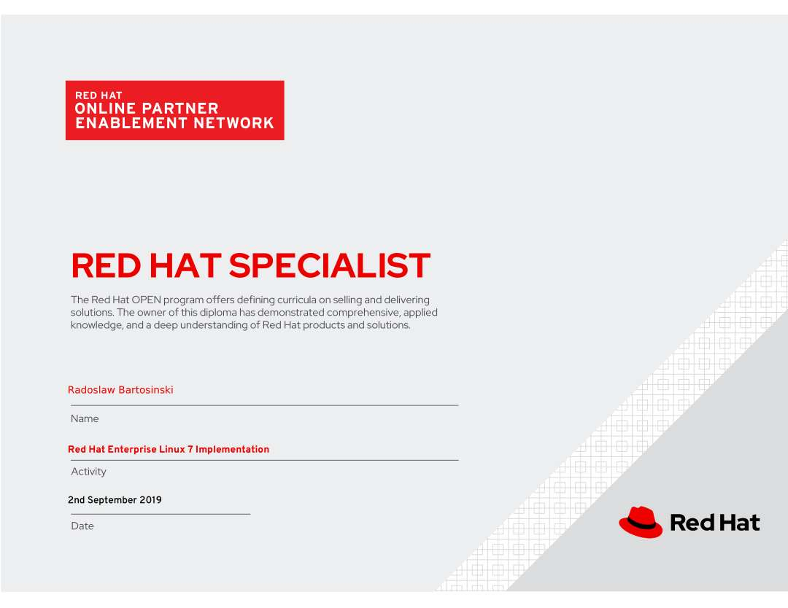
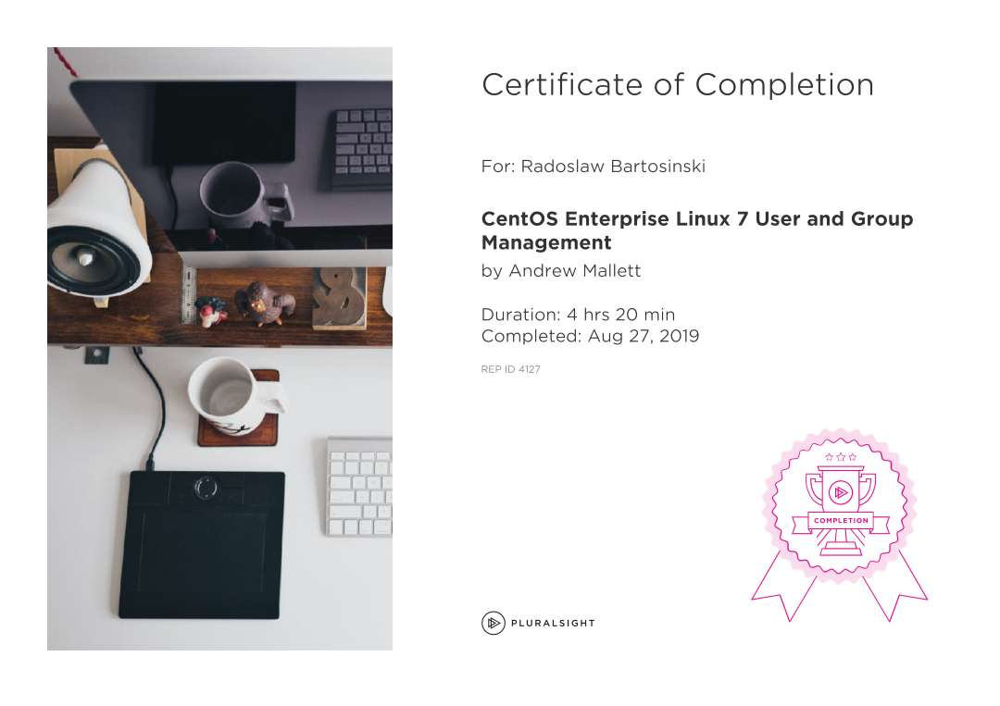
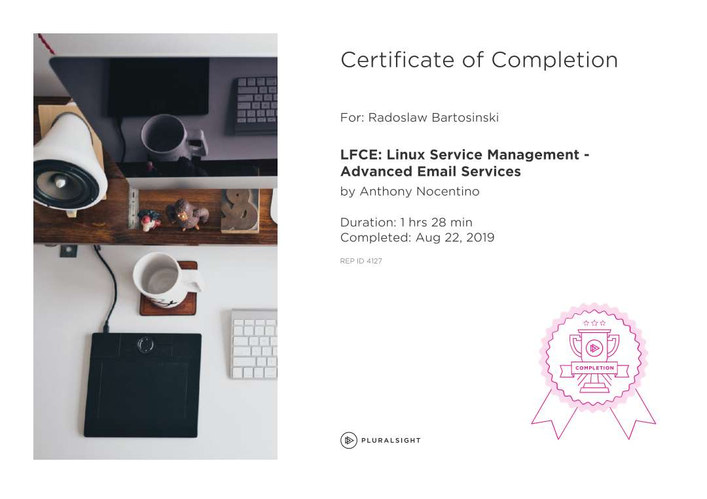

# Linux/Unix - Descriptions about management and administrating
 Knowledge base about basics and standards in Linux/Unix management (RHEL, CentOS)

[System management](#question1)

1. [Shell](#question2)
2. [Services](#question3)
3. [Processes](#question4)
4. [Users, Groups, PAM](#question5)
5. [OpenLDAP, Kerberos](#question6)
6. [Permissions, Umask, ACL](#question7)
7. [rpm, yum, RHEL subscryption](#question8)
8. [Booting](#question9)
9. [SELinux](#question10)
10. [Systemd/Init](#question11)
11. [Systemd log/journald, logging](#question12)
12. [Monitoring & Performance - CPU, RAM](#question13)

[Storage management](#question15) 

1. [Block devices, Partitions, File System](#question16)
2. [Logical Volume Manager](#question17)
3. [Network File System, Samba](#question18)
4. [iSCSI - remote block storage](#question19)
5. [Monitoring & performance](#question20)

[Network management](#question21)  
 
1. [Routing, hosts, ports & protocols](#question22)
3. [SSH](#question23)
2. [Security, Firewalld](#question24)
4. [IPv4, IPv6](#question25)
5. [DNS](#question26)
6. [Bridges](#question27)
7. [Apache](#question28)
8. [Postfix](#question29)
9. [Monitoring & Performance](#question30)

[***Passed trainings certs: RedHat Open, Pluralsight](#question31)

# System management

## 1. Shell

- Wszystko w Linuxach ma reprezentację w postaci pliku np. pliki; katalogi; urządzenia; network sockets (gniazda) itd.

- File system tree - Filesystem Hierarchy Standard (FHS) - definiuje standardy nazw; root - punkt poczatkowy.

`/`
najwyższy poziom systemu plików

`/boot`
kernel, konfiguracja bootowania

`/etc`
pliki konfiguracji systemu

`/root`
home directory użytkownika root

`/media`
nośniki usuwalne DVD, CD, USB

`/mnt`
sieciowy system plikow

`/opt`
optional soft, add-on packages (pakiety dodatkowe)

`/usr`
programy, konfiguracje, nagłówki, biblioteki - user file system

`/usr/bin`
krytyczne pliki binarne dla systemu operacyjnego

`/usr/sbin`
pliki binarne administratora

`/var`
variable data, prints, maile, logi

`/dev`
device file system - show all conn devices

`/proc`
process file system - runnings state of the kernel, processes and memory info

`/sys`
system file system - pomaga zarządzać podłączonym hardware

`/tmp`
podręczne - nie powinno się zakładać że info w tmp będzie przechowywane pomiędzy uruchomieniami

    ls
    ll 
    ls /boot/
  
Urządzenia:
 
    ls /dev

np. lp0 - line printer 0 (first on the system)

    ll/dev/lp0
    ll/dev/disk
    
konfiguracje:

    ls /etc

id procesu:

    ps 
    ls /proc/1502
    more /proc/1502/io    (details about 1502)
    more /var/log/messages

absolute dirs vs relative dirs 

    ./ 
    ../ 
    ../../ 

    ln -s myFile myLink
    ll myLink
    ln myFile myLinkHard
    ll -i myLinkHard
    ll -i myFile

to samo ID pliku

Komendy: pliki

    touch 
    rm 
    mv 
    cat
    less/more
    head/tail       (glowa i ogon 10 pierwszych i ostatnich linii pliku)

Komendy: katalogi

    mkdir
    rm 
    rmdir 
    mv 
    ls - view content

find path expression np.
    
    find /home -name abxx

## 3. Services management

Demony: procesy, które czekają lub działają w tle, wykonując różne zadania
- Zazwyczaj uruchamiają się automatycznie w czasie rozruchu i kontynuuj do momentu wyłączenia lub ręcznego zatrzymania
- Nazwy zwykle kończą się na d

Socket: Używany przez demona do nasłuchiwania połączeń
- Główny kanał komunikacji z lokalnymi lub zdalnymi klientami
- Mogą być tworzone przez demony lub oddzielane od demona i tworzone przez inny proces
- Przekazywane do demona, gdy klient nawiązuje połączenie

Usługa: często odnosi się do jednego lub więcej demonów
- Uruchomienie / zatrzymanie usługi może zamiast tego spowodować jednorazową zmianę stanu systemu
- Nie wymaga pozostawienia uruchomionego procesu demona
- Nazywa się oneshot

Stany usług
- loaded - plik konfiguracji jednostki przetworzony
- active (running) - Uruchomiony z jednym lub więcej ciągłymi procesami
- aktywne (exited) - Pomyślnie zakończono jednorazową konfigurację
- aktywne (waiting) - działa, ale czeka na zdarzenie
- nieaktywny - nie działa
- enabled  - rozpocznie usługę w czasie uruchamiania
- disabled  - nie uruchamia się w czasie uruchamiania
- static - Nie można włączyć, ale może zostać uruchomiony automatycznie przez włączone urządzenie

Systemctl:

    systemctl --type=service
    
    systemctl is-active sshd
    systemctl is-enabled sshd
    
    systemctl list-units --type=service                 -tylko aktywne
    systemctl list-units --type=service --all
    systemctl --failed --type=service
    
    
Controlling System Services

    systemctl status sshd.service                       - View service status
    ps -up PID                                          - Verify that process is running
    systemctl start 
    systemctl restart
    systemctl reload
    systemctl status                                    - po wywołaniu start/stop do sprawdzenia wykonania operacji

Zależności jednostek
- Może uruchamiać usługi jako zależności innych usług
- Aby całkowicie zatrzymać usługi drukowania systemu, zatrzymaj wszystkie trzy jednostki
- Wyłączenie usługi wyłącza zależności

Lista zależności:

    systemctl list-dependencies unit_name

Usługi maskujące
- W systemie mogą być zainstalowane usługi powodujące konflikt
- Usługa maskowania zapobiega przypadkowemu uruchomieniu usługi przez administratora
- Tworzy łacznik (link) w katalogach konfiguracji

Mask:

    systemctl mask network
        ln -s '/dev/null' '/etc/systemd/system/network.service'
    
    systemctl unmask network
        rm '/etc/systemd/system/network.service'

    systemctl mask unit_name            - completely disable service from being started, both manually and at boot

Enabling System Daemons to Start or Stop at Boot

    systemctl disable sshd.service
    systemctl status sshd.service
    

## 2. Processes management

###Sygnały do ​​sterowania procesami

Sygnał - informacja o przerwaniu działania oprogramowania do procesu, które zgłasza zdarzenia do programu

Zdarzenia generujące sygnały:
- Błędy
- Zdarzenia zewnętrzne (żądanie Wejść / Wyjść, upłynięcie czasu itp.)
- Jawne żądania (polecenie wysyłania sygnału, sekwencje klawiszy)

Killing process
- 1 HUP Hangup 
    - Używany do zgłaszania zakończenia procesu kontrolowania terminala.
    - Służy również do żądania ponownego zainicjowania procesu (przeładowania konfiguracji) bez zakończenia.
- 2 INT Przerwanie klawiatury 
    - Powoduje zakończenie programu. 
    - Może być zablokowany lub obsługiwany. 
    - Wysyłane przez wpisanie znaku INTR (Ctrl-c).
- 3 QUIT Keyboard quit 
    - Podobne do SIGINT, ale powoduje zrzut procesu po zakończeniu. 
    - Wysłane przez wpisanie znaku QUIT (Ctrl- \).
- 9 KILL 
    - niemożliwy do zablokowania - powoduje nagłe zakończenie programu.
- 15 TERM Terminate 
    - Domyślny. Powoduje zakończenie programu. 
    - W przeciwieństwie do SIGKILL, można go blokować, ignorować lub obsługiwać. 
    - „Uprzejmy” sposób żądania zakończenia programu; umożliwia self-cleanup.
- 18 CONT Kontynuuj 
    - Wysłano do przetworzenia, aby wznowić działanie, jeśli zostanie zatrzymane.
    - Nie można zablokować. Nawet jeśli zostanie obsłużony, zawsze wznawia proces.
- 19 STOP Stop, odblokowalny 
    - zawiesza / zawiesza / proces. Nie można go zablokować ani obsłużyć.
- 20 TSTP Blokada klawiatury 
    - W przeciwieństwie do SIGSTOP, może być blokowana, ignorowana lub obsługiwana. 
    - Wysyłane przez wpisanie znaku SUSP (Ctrl-z).

Każdy sygnał ma domyślną akcję:

- TERM: Powoduje natychmiastowe zakończenie programu (wyjście)
- RDZEŃ: powoduje, że program zapisuje obraz pamięci (zrzut pamięci), a następnie kończy działanie
- STOP: Powoduje, że program przestaje działać (zawiesza) i czeka na kontynuację (wznawianie)

Killing Processes - Sending Signals by Explicit Request

- To suspend, use Ctrl-z
- To kill, use Ctrl-c
- To core dump, use Ctrl-\

Users can kill own processes, need root privileges to kill processes owned by others

`kill` sends signal to process by ID

    kill PID
    kill -signal PID
    kill -l

`killall` to send signal to one or more processes matching selection criteria
- Command name
- Processes owned by specific user
- All systemwide processes

kilall

    killall -signal -u username command_pattern
    
display remote users' connecting system name in FROM column      
    
    w -f                    

Killing User Sessions

    pgrep -l -u bob
    pkill                       - terminate all processes for one user
    pkill -SIGKILL -u bob
    pgrep -l -u bob

SIGKILL is commonly misused instead of SIGTERM
- SIGKILL cannot be handled or ignored; it is always fatal
- SIGKILL forces termination without self-cleanup routines
- Use SIGTERM first; use SIGKILL only if process fails to respond

### Scheduled processes

#### System cron jobs
- Nie zdefiniowane za pomocą crontab
- Skonfigurowany w zestawie plików konfiguracyjnych
- Pliki konfiguracyjne mają dodatkowe pole między polami dnia tygodnia i polami poleceń

Systemowe zadania CRON zdefiniowane w:

    /etc/crontab
    /etc/cron.d/*
    
    crontab -e

#### Predefiniowane zadania
- Uruchamianie: co godzinę, dzień, tydzień, miesiąc

Wykonuje wszystkie skrypty umieszczone w:

    /etc/cron.hourly/
    /etc/cron.daily/ 
    /etc/cron.weekly/ 
    /etc/cron.monthly/

- Katalogi muszą zawierać skrypty, a nie pliki konfiguracyjne cron

- Cogodzinne skrypty są uruchamiane przy użyciu części roboczych z zadania zdefiniowanego w `/etc/cron.d/0hourly`

- Zadania codzienne, tygodniowe i miesięczne są wykonywane przy użyciu części roboczych z pliku konfiguracyjnego `/etc/anacrontab`
    - Plik analizowany przez daemona `crond`
    - Zapewnia, że ważne zadania są zawsze uruchamiane

## 4. Users, Groups, PAM

### Użytkownicy
- Każdy proces (uruchomiony program) działa pod konkretnym użytkownikiem
- Każdy plik jest własnością konkretnego użytkownika
- Dostęp do plików i katalogów jest ograniczony przez użytkownika
- Użytkownik powiązany z uruchomionym procesem określa pliki i katalogi, do których proces może uzyskać dostęp

ID

    ls -l
    
    ps                                  // informacje o procesie
    ps au                               // a - wszystkie procesy; u - użytkownik powiązany z procesem;
    /etc/passwd                         // Names / UID mapowane miejsce zapisane
    /etc/group                          // zdefiniowane grupy lokalne
    

#### Użytkownik root
- root jest superużytkownikiem w Red Hat Enterprise Linux
- Może zastąpić normalne uprawnienia
- Zarządza i administruje systemem
- **zaloguj się jako standardowy użytkownik i eskaluj do roota tylko w razie potrzeby

Linux - grained permissions model
- root może zrobić wszystko
- standardowi użytkownicy nie mogą zarządzać systemem

Sudoers:
 
    /etc/sudoers                        // pozwala użytkownikom uruchamiać polecenia jako root lub inny użytkownik
    /var/log/secure                     // polecenia wykonywane za pomocą sudo są logowane w bezpiecznym logu

PolicyKit

    man polkit

/etc/passwd

    useradd - nazwa użytkownika         // ustawia rozsądne wartości domyślne dla wszystkich pól w / etc / passwd
    userdel - nazwa użytkownika         //usuwa użytkownika z / etc / passwd
    userdel -r nazwa użytkownika        // usuwa użytkownika i katalog domowy użytkownika

- Usuń wszystkie nieposiadane pliki, gdy użytkownik, który je utworzył, zostanie usunięty
- Ręcznie przypisz nieznane pliki do innego użytkownika
- root może znaleźć niepotrzebne pliki i katalogi, uruchamiając:
`find / -nouser -o -nogroup 2> /dev/null`

hasło użytkownika, aby ustawić początkowe hasło użytkownika lub zmienić istniejące hasło użytkownika

Zakresy UID
- UID 0: Zawsze przypisany do konta administratora, root
- UID 1-200: Użytkownicy systemu przypisani statycznie do procesów systemowych przez Red Hat
- UID 201-999:
    - Użytkownicy systemu przypisywani dynamicznie do procesów systemowych, które nie są właścicielami plików w systemie plików. 
    - Zwykle przypisywany z dostępnej puli, gdy instalowane jest oprogramowanie, które ich potrzebuje. 
    - Programy działają jako „nieuprzywilejowani” użytkownicy systemu, aby ograniczyć dostęp do zasobów wymaganych do działania
- UID 1000+: Dostępne do przypisania zwykłym użytkownikom

login shell (su radek) vs non-login shell (su -///su bez żadnego argumentu używane przy byciu w określonej ścieżce jednak przy userze obecnym)

    echo $USER
    id

as a root (su -l; pwd: /root)

    vi .bashrc
    vi .bash_profile
    
w non-login nie używamy `/etc`

system login scripts:

    cd /etc
    ls profile*
    
    vi /etc/bashrc
    
domyślny katalog przechowywania wzorców tworzenia nowych użytkowników

    /etc/skel 

*ls nie pokazuje domyślnie ukrytych plików

    ls -A
    ls -a

    grep radek /etc/passwd
    grep radek /etc/passwd
    grep radek /etc/passwd
    grep radek /etc/passwd

ID

    id
    id radek
    id root
    id -G
    id -Gn

- każdy user musi mieć zdefiniowane ID i ID grupy

    - być może nie zawsze potrzebne jeśli serwer obsługuje np aplikację webową
    - jesli natomiast jest to klient samby czy nfs użytkownicy będą wpływać na fs i uprawnienia, konta są ważne

- lokalni użytkownicy

- użytkownicy domeny

#### Wheel
grupa prywatna radek i grupa wheel przeznaczona do administracji systemem

    useradd -m radek2
    useradd -N radek3                       //// no specified primary group ID
    useradd radek4 -G adm -s /bin/sh        ///-s shell
    
    tail -n 1                               ///ostatnia linia pliku do odczytu
    tail -n 1 /etc/passwd
    
    ls /home 
    
    ls -l /sbin/adduser

Set pass:

    passwd user1
    tail -n 1 /etc/shadow
    grep user1 /etc/shadow
    grep user. /etc/shadow

Change pass:

    chpasswd

    echo myNewPassw | passwd user2 --stdin
    
    chage -l radek // sprawdza
    chage radek // zmienia

default added user settings:

    /etc/login.defs

inne ustawienia:

    useradd -D ///sprawdzenie
    useradd -Ds /bin/sh ///zmieni shell
    useradd -D /bin/sh

lub bezpośrednio zmieniać w pliku:

    /etc/default/useradd

modyfikacja użytkownika:

    usermod -c "User Radek" radek
    grep radek /etc/passwd

    grep radek /etc/passwd

    chsh -l                         /// zmiana powłoki dla usera; -l lista wszystkich dostępnych
    chsh -s /bin/sh
    
lub:

    usermod -sh /bin/bash radek

    userdel -r radek                /// -r usunie też home dir użytkownika, bufora poczty i pliki cron
    userdel radek                   /// usunięcie użytkownika bez danych
    
    find /home -uid 1002 -delete    /// przeszukanie lokalizacji /home i usunięcie plików których właścicielem jest user o id uid=1002.

## Grupy:

### Grupy podstawowe
- Każdy użytkownik ma jedną grupę podstawową
- Zdefiniowane przez GID w /etc/passwd
- Grupa podstawowa jest właścicielem plików utworzonych przez użytkownika
- Podstawową grupą nowego użytkownika jest nowa grupa o tej samej nazwie co użytkownik
- Użytkownik jest tylko członkiem tej grupy prywatnej użytkownika (UPG)

### Grupy dodatkowe
- Grupy dodatkowe zapewniają uprawnienia dostępu do plików i innych zasobów

Supplementary Groups
Group must exist before user can be added to it

    groupadd
    groupadd -g GID
    groupadd -r - create system group using GID from range listed in /etc/login.defs

    groupmod
    groupmod -n javaapp appusers - -n new name
    groupmod -g 6000 ateam - -g new GID

    groupdel
    groupdel javaapp                 
    
- cannot be removed if it is primary group of user
    - check all file systems to ensure that no files remain owned by deleted group

    usermod -g wheel student - Primary group change 
    usermod -aG wheel elvis - add user elvis to supplementary group wheel; -a (append mode) without a user is removed from all supplementary groups

    /etc/group
    grep radek /etc/group
    /etc/gshadow                    ///hasła grup
    
    newgrp wheel                    /// zmienia grupę; działa w runtime - przy dodawaniu nowego pliku zmienią się uprawnienia
    exit                            /// powroci do std układu wprowadzania grupy
    
    groupadd mynewgroup
    groupdel
    groupmod

#### Ustawienia grupy a ustawienia członkostwa:

    id -g primary groups 
    id -gn primary groups show names
    id -G secondary groups
    id -Gn secondary groups show names

    usermod -G mynewgroup,wheel radek
    usermod -Gn radek
    usermod -G mynewgroup radek

można też dodać u do g:

    gpasswd -a radek mynewgroup                             ////-a dodanie jednego usera
    gpasswd -M radek, radek2,root dodanie mynewgroup        ///-M listy członków (membership)
                                                                **przelogowanie do odświeżenia pełnej listy zmian grup

    grep apache /etc/group

    chgrp -R apache /var/www/html  ///rekursywnie w dół = zmiany także w podkatalogach
    
    chmod g+s . ////(group+special dla wszystkich plików)

### Hasła
- Default hashing algorithm (1 indicates MD5 hash, 6 indicates SHA-512) can be changed by root
    - `authconfig --passalgo` with argument md5, sha256, or sha512

Shadow - plik haseł:

    /etc/shadow
    
format - name:password:lastchange:minage:maxage:warning:inactive:expire:blank

    chage                                   / account expiration date
    expired account                         / change expiration date

    usermod -L username                     / lock account
    usermod -U username                     / unlock account

#### nologin Shell

Set user’s login shell:

    /sbin/nologin
    usermod -s /sbin/nologin student
    
- nologin shell uniemożliwia interaktywne korzystanie z systemu

#### Grupy - hasła:

    gpasswd adm
    gpasswd radek
    newgrp admi ///w drugim kroku możesz użyć newgrp

- mniejsze bezpieczeństwo jeśli grupa posiada hasło

### PAM - Plugable Auth Module:

    /etc/pam.d/
    
    /lib64/security/
    
    vi /etc/login.defs      /// opcje np tworzenie katalogu domowego
    
    rpm -qa ///lista zainstalowanych modułów
    rpm -qwa | grep ssss
    
    
    yum install oddjob
    oddjob                  /// w RHEL7 preferowany mechanizm do pokonania ograniczeń
    
    systemctl enable oddjobd
    systemctl start oddjobd
    
    authconfig --enablemkhomedir --update
    
    cd /etc/pam.d
    
    grep mkhomedir *

wymagania dot. hasła:

    cat/etc/pam.d/system-auth
    >>
    less /etc/secutity/pwquality.conf

    pwscore

    >>> haslo

    ulimit -i
    ulimit -u                       /// liczba procesów zezwolonych jednemu użytkownikowi

np. limit dla kolejnych wywołań rekurencyjnych uruchomień procesów

    vi /etc/security/limits.conf

Można też okreslić kiedy użytkownik będzie mógł się zalogować, w jakich dniach godzinach etc.

    vi /etc/pam.d/sshd          ///wpisy dotyczące wymagań podczas logowania przez ssh
        + linia: account	required	pam_time.so

    /etc/security/time.conf
    + linia np:
    *;*;radek|user_name;Wk0800-1800  ////* - wszystkie usługi; * - wszystkie terminale; grupa użytkowników| nazwa_konkretnego_usera; Wk weekday + godziny
    *;*;radek|user_name;!Wk0800-1800 - !Wk - not week day

## 5. OpenLDAP, Kerberos

- OpenLDAP - obsługa scentralizowanego logowania.

- Usługi zarządzania tożsamością - scentralizowane zarządzanie tożsamością

- Informacje o koncie:
    - Informacje takie jak nazwa użytkownika, katalog domowy, UID i GID, członkostwo w grupach itp.
    - LDAP i NIS

- Informacje uwierzytelniające dla systemu w celu weryfikacji użytkownika:
    - Zapewnienie kryptograficznego skrótu hasła do systemu klienta
    - Wysyła zaszyfrowane hasło do serwera i otrzymuje odpowiedź

- Serwer LDAP zapewnia zarówno informacje dotyczące uwierzytelnienia, jak i konta

- Kerberos zapewnia tylko uwierzytelnianie SSO
    - Zwykle używany z LDAP
    - Używany zarówno w serwerze IPA, jak i Active Directory

#### Serwer IPA
LDAP i Kerberos w połączeniu z wierszem poleceń i narzędziami internetowymi

    echo $HOME
    echo $PATH                          /// w zależności od su -; su; std_user

    tail -5 /var/log/messages           /// 5 ostatnich linijek loga/messages

    groupadd -g 31000 new_group - tworzy supplementary group pod nazwą new_group o ID 31000
    groupadd new_local_group - tworzy supplementary group  new_local_group
    tail -5 /etc/group

Sprawdzenie konfiguracji i firewalla:

    netstat -ltn
    netstat -lt
    
    firewall-cmd --permanent --add-service=ldap
    firewall-cmd --reload
    
Instalacja i konfiguracja OpenLDAP:
    
    yum install openldap openldap-clients openldap-servers migrationtools.noarch        /// narzędzie migracyjne dla passwd > ldap
    
    cp /usr/share/openldap-servers/DB_CONFIG.example /var/lib/ldap/DB_CONFIG
    ls- l /var/lib/ldap/
    slaptest
    chown ldap.ldap /var/lib/ldap/*
    
    /etc/openldap/schema/
    
    ldapadd -Y EXTERNAL (external auth) -H ldapi:/// (protokół ldapi na localhost) -D "cn=config" -f cosine.ldif (definiuje schemat który właśnie towrzymy)
    ldapadd -Y EXTERNAL -H ldapi:/// -D "cn=config" -f cosine.ldif
    ldapadd -Y EXTERNAL -H ldapi:/// -D "cn=config" -f nis.ldif
    
    slappasswd                                          /// stworzyć zaszyfrowane hasło dla admina
    slappasswd -s radek6 -n > rootpwd

plik szkoleniowy config.ldif + modyfikacje dla radek.localhost

    ldapmodify -Y EXTERAL -H ldapi:/// -f config.ldif

obiekty kontrolowane przez dn
    
    dn - distinguish name

plik szkoleniowy structure.ldif + modyfikacje dla radek.localhost
    
    ldapadd -x -W -D "cn=Manager",dc=radek,dc=local" -f structure.ldif

    vi /usr/share/migrationtools/migrate_common.ph
    
    
      487  ldapadd -x -W -D "cn=Manager,dc=example,dc=dom" -f structure.ldif 
      488  slappasswd
      489  vi config.ldif 
      490  ldapmodify -Y EXTERNAL -H ldapi:/// -f config.ldif
      496  vi structure.ldif 
      499  vi group.ldif 
      500  ldapadd -x -W -D "cn=Manager,dc=radek,dc=local" -f group.ldif 
      501  cd /usr/share/migrationtools/
      503  vi migrate_common.ph 
      504  grep radek /etc/passwd
      505  grep radek:x:1000 /etc/passwd
      506  grep radek:x:1000 /etc/passwd > passwd
      510  cat passwd 
      511  vi passwd 
      512  /usr/share/migrationtools/migrate_passwd.pl passwd user.ldif
      514  cat user.ldif 
      515  vi user.ldif 
      516  ldapadd -x -W -D "cn=Manager,dc=radek,dc=local" -f user.ldif 
      517  su bartek
      518  getent passwd
      519  authconfig --enableldap --ldapserver=server0.radek.loacl --ldapbasedn="dc=radek,dc=local" --enablemkhomedir --update
      520  getent passwd
      521  grep passw /etc/nsswitch.conf
      522  su bartek
      523  su - bartek
      524  authconfig-tui
      525  authconfig --enableldap --ldapserver=server0.radek.loacl --ldapbasedn="dc=radek,dc=local" --enablemkhomedir --update
      526  getent passwd

### Kerberos

    vi usr/lib/systemd/system/rngd.service
    
    +dodać do linii: /sbin/rngd -f 
    -r /dev/urandom
    /sbin/rngd -f -r /dev/urandom
    
    netstat -lt ///listening + tcp ports
    
    
Kadmin.local:

Pierwsza konfiguracja:

    listprincs
    addprinc root/admin
    addprinc radek
    addprinc -randkey host/server0.radek.local
    listprincs
    ktadd host/server0.radek.local
    
    
    vi etc/ssh/ssh_config:
    
    **odkomentować dwie linijki:
    GSSAPIAuth yes
    GSSAPIDelegate yes

## 6. Permissions, Umask, ACL

### Chmod: read, write, execute

#### chmod 
- Short for change mode; Permission instruction: Symbolic or numeric

pierwsza litera charakteryzuje typ pliku 

`-` - regular file

`d` - directory

`p` - named pipe

`l` - sym link

`b` - block device

`c` - character device

`s` - socket

    stat -c %a /etc/hosts (octal permissions np. 644: 6- r+w, 4- r, 4- r)
    stat /etc/hosts

- read - octal 4 - binary 100

- write - octal 2 - bin 010

- execute - octal 1 - bin 001

Zapis słowny vs ósemkowy:

    rwx         4+2+1=7
    r-x         4+0+1=5

    touch myfile
    chmod u+x myfile                                                                                                                                               
    chmod 700 myfile
    chmod +x myfile
    chmod -x myfile
    
    chmod o= myfile                     ///others = nothing; others have no rights
    chmod u=rwx myfile
    chmod u=rwx,go= myfile              /// == chmod 700 myfile

- X permissions (nie x) - wskazuje ustawienie uprawnień dla katalogów, a nie plików
- flaga -R - recursively set permissions on entire directory tree

wykonanie:

    chmod -R g+rwX demodir
    chown -R student foodir         - Change File Ownership +R recursively
    chown :admins foodir            - Change Group Ownership
    chown visitor:guests foodir

- zmiana przypisanej grupy także polecenie `chgrp`

### Umask

- Domyślne uprawnienia do plików ustawione przez procesy, które je tworzą; 
    - np: edytory tekstu tworzą pliki, które można odczytać i zapisać, ale nie można ich wykonać
    - `mkdir` tworzy katalogi ze wszystkimi ustawionymi uprawnieniami: odczyt, zapis, wykonywanie

- `umask` - ósemkowa maska bitowa używana do usuwania uprawnień do plików i katalogów tworzonych przez proces
    - `umask 077` usuwa wszystkie uprawnienia grupowe i inne nowo utworzonych plików (każdy nowy plik bez żadnych uprawnień)

- Domyślne uprawnienia do plików
    - Zaloguj się jako root, aby zmienić domyślną umask dla nieuprzywilejowanych użytkowników
    - `/etc/bashrc`
    - `/etc/profile` 

- default permissions 666 for the file, for the directory 777

#### Special Permissions

1. setuid  - zastosowanie dla plików 
    - plik jest wykonywany jako użytkownik będący właścicielem pliku, a nie użytkownik, który uruchomił plik
2. sticky  - zastosowanie dla katalogów 
    - użytkownicy z uprawnieniami do zapisu w katalogu mogą usuwać pliki, których są właścicielami; 
    - nie mogą usuwać ani wymuszać zapisów w plikach należących do innych użytkowników
3. setgid  - zastosowanie dla plików i katalogów 
    - Plik wykonuje się jako grupa, która jest właścicielem pliku 
    - Właściciel grupy nowo utworzonych plików w katalogu jest tym samym właścicielem grupy co katalog

Wykonanie:

    setuid = u+s
    setgid = g+s
    sticky = o+t

    setuid = 4
    setgid = 2
    sticky = 1
    
    chmod 2770 directory

Sticky Bit // SGID Bit  & SUID Bit set group & user id:

    chmod 1777
    chmod o+t/shared

File tests:

    test -f file -d directory
    test -f /etc/dev && echo "echo ping"            //wróci czy nie

### Access Control Lists (ACLs):\

Fine-grained control to files and dirs

    -rwxrw----+                         /// + wskazuje na ustawienie ACL skojarzone z plikiem 
    getfacl .                           ////directory

    setfacl                             - To add, modify, or remove standard ACLs
    setfacl -m u:name:rX file           - Modify a User
    setfacl -m g:ame:rw file            - Modify a Group
    setfacl -m o::- file                - Modify the Other 
    
    setfacl -m u:rwx,g:sodor:rX,o::- file       - Add Multiple Entries
    
    getfacl file-A | setfacl --set-file=- file-B
    
    setfacl -R -m u:ame:rX directory            - Recursive; Can use X with recursion; Use X when non-recursively setting ACLs
    setfacl -x u:name,g:name file               - Can use delete (-x) and modify (-m) in same 
    setfacl -b file                             - To delete all ACLs on file or directory

Default ACL Permissions (new files and subdirectories automatically inherit)

    setfacl -m d:u:name:rx directory -  (d:u:name; d: or use -d option)

    umask 027                         

- change umask in runtime; in the new shell will be std umask 0002
- change the default umask (dla określonego użytkownika)

Wykonanie:

    echo "umask 007" >> ~/.bashrc
    cat ~/.bashrc

#### Testowy Apache
    
    yum install httpd
    
    firewall-cmd --zone=public --permanent --add-service=http
    firewall-cmd --reload
    
    echo Apache on RHEL 8 / CentOS 8 > /var/www/html/index.html
    
    PRIV IP:
    hostname -I
    ifconfig
    
    PUBLIC IP:
    curl ifconfig.mec
    
    CONFIG APACHE
    cd /etc/httpd/conf
    ls

Default ACL can be applied only for DIRs

    setfacl -m d:u:ec2-user:r,d:o:- /var/www/html/ 

    ls -ld /var/www/html/                                               
    drwxr-xr-x+ 2 root root 24 Jul 30 12:52 /var/www/html/

symbol + na końcu linii mówi o ACL

Apache i ACL: 
                     
    778  yum install wget                                                                                   
    779  wget https://www.psy.pl/wp-content/uploads/2017/05/szczesliwy-pies.jpg                             
    780  ls                                                                                                 
    781  cp szczesliwy-pies.jpg images                                                                      
    782  ls /images                                                                                         
    783  ls images                                                                                          
    784  mv szczesliwy-pies.jpg images                                                                                                                                                                  
    790  rm imdex2.html                                                                                     
    791  rm index2.html                                                                                     
    792  rm index3.html                                                                                     
    793  ls                                                                                                 
    794*                                                                                                    
    795  ls                                                                                                 
    796  cat index.html                                                                                     
    797  systemctl restart nfs-server                                                                       
    798  systemctl restart httpd.service                                                                    
    799  ls -l                                                                                              
    800  umask                                                                                              
    801  chmod 777 index.html                                                                               
    802  ls                                                                                                 
    803  ls -l                                                                                              
    804  ls -l images                                                                                       
    805  chmod 777 images/szczesliwy-pies.jpg                                                               
    806  chmod 777 images                                                                                   
    807  ls                                                                                                 
    808  umask 000                                                                                          
    809  umask                                                                                              
    810  touch neww                                                                                         
    811  ls                                                                                                 
    812  ls -l                                                                                              
    813  setfacl -bn                                                                                        
    814  cd ..                                                                                              
    815  setfacl -bn html                                                                                   
    816  cd html                                                                                            
    817  touch new                                                                                          
    818  ls -l                                                                                              
    819  vim new                                                                                            
    820  setfacl -b index.html                                                                                                                                                              
    822  systemctl restart httpd.service 

NFS i ACL:

    mkdir -m 700 /private                                                      
    setfacl -m u:ec2-user:rwx /private/                                              
    cd /private                                                                          
    setfacl -m d:u:ec2-user:rwx /private/      //// -d: default wpłynie na każde utworzone pliki w danym DIR

    getfacl /private/
    getfacl -d /private/ ----- tylko z default z flagą "d"

    setfacl -x d:u:ec2-user /private/
    
    getfacl /private/ > /home/ec2-user/acl.txt   \EXPORT                            
    ls -l /home/ec2-user/                                                                 
    cat /home/ec2-user/acl.txt                                                            
    sudo setfacl -b /private/                                                                         
    ls -ld /private                                                                                                                                                                                                           57                                                                                                                  58  sudo setfacl --restore=/home/ec2-user/acl.txt                                                                   59  ls -ld /private 

    547  systemctl restart nfs-server                                                                                    
    548  showmount -e myserver                                                                                          
    549  cd /etc/exports                                                                                                
    550  cat /etc/exports                                                                                               
    551  export host                                                                                                    
    552  /exported/directory                                                                                            
    553  cd /exported/directory                                                                                         
    554  cat /exported/directory                                                                                        
    555  mkdir -p /export/users                                                                                         
    556  mount --bind /home/ /export/users                                                                              
    557  ls /export/users/                                                                                                                                                                                      
    559  vim /etc/exports 
     + dodana linia: /export *(rw,sync,fsid=0,crossmnt) 
                                                                                   
    560  exportfs -a                                                                                                    
    561  mount localhost:/ /mnt                                                                                         
    562  ls /mnt/users/ 
    563  ls /export/users/

## 7. Pakiety, rpm, yum

- Zależności i ich konfigurowanie było problematyczne kiedy nowe programy dociągało się i instalowało 

- czasami zależności było dużo

#### RPM - Redhat Packet Manager

    /usr/share/doc

rpm:
- pliki, foldery, biblioteki, skrypty, pliki binarne
- dokumentacje
- metadane
- wersjonowanie
- info o pakietach rpm w bazie danych systemu
- weryfikowalne
- nazewnictwo "szeregowe"

rpm manager:
- build - kompilacja źródła do binary rpm
- install
- query - zapytanie do bazy danych o zakres informacji metadanych
- verify - weryfikacja i porównanie pakietów zainstalowanych z innymi
- upgrade - aktualizacja lub instalacja jeśli pakiet nie jest zainstalowany
- freshen - aktualizacja tylko jesli pakiet jest zainstalowany
- erase - odinstalowanie

rpm -q

    rpm -qip nazwa_pakietu.rpm              / metadane z grubsza
    rpm -qlp nazwa_pakietu.rpm              / pliki w pakiecie
    rpm -qlp nazwa_pakietu.rpm | more
    rpm -K nazwa_pakietu.rpm                / zweryfikować rpm poprzez zgodność podpisu, suma MD5, pakiet nie będzie poprawnie zweryfikowany jeśli cokolwiek wewnątrz pakietu ulegnie zmianie      
    
    rpm -ivh nazwa_pakietu.rpm              / instalacja
    rpm -q  nazwa_pakietu.rpm               / czy jest zainstalowany
    rpm -qa                                 / wszystkie qa zainstalowane w systemie
    rpm -qf /etc/firewalld                  / zapytaj o plik (query file) i dane z której/jakiej paczki pochodzi?
    
    rpm -qi packet_output_name.rpm          / informacje z bazy systemu o rpm a nie jak poprzednio -qip z katalogu lokalnegow którym znajduje się paczka
    rpm -e mc                               / e: erase, po zakończeniu pracy na pakiecie
    rpm -U nazwa_pakietu.rpm                / upgrade
    rpm -Vv firewalld                       / co sie zmieniło w stosunku do pierwszej wersji
    
    rpm2cpio nazwa_pakietu.rpm | cpio       / przepuszczenie pakietu przez archiwum - jeśli pliki się zgubiły można je tam odnaleźć/odzyskać
    

### built own rpm packages

vault.centos.org

    cat /etc/centos-release

    rpm -qlp nazwa.rpm                      / podejrzyj pliki wewnątrz paczki

- jeśli jest wewnątrz plik 
    - .tar.xz - są to źródłowe pliki
    - .spec - specyfikacja budowania paczek

exaple

    rpm2cpio nazwa.rpm | cpio -id           / rozpakuje archiwum rpm
    tar -xf nazwa.tar.xf                    / rozpakuje plik tar do nowego dir

- komponenty do budowania własnych pakietów rpm

    yum group install "Development Tools"

    rpmbuild --rebuild nazwea_pakietu.rpm

- jeśli pojawai sie failed dependencies tzn. że trzeba zainstalować podane pakiety

    yum install ncurses-devel ......

- nie ma w tym katalogu gdzie tworzyliśmy tylko w głównym użytkownika 

- ***uważać na tworzenie paczek spod roota - ma duże możliwości także zmian na systemie

    ls -R rpmbuild                     / recursive ls
    
    yum info rpmdevtools

- umieszczenie plików w SOURCES i w SPEC: napisanie pliku w spec na podstawie templatki

- deployment tak stworznego pliku na innych maszynach

### YUM - Yellowdog Updater Management

yum - narzędzie wiersza polecenia służące do instalowania, aktualizowania, usuwania i sprawdzania (query) pakietów oprogramowania

    yum list 'http*'               - wyświetla zainstalowane i dostępne pakiety
    yum search SŁOWO_KLUCZOWE       - wyświetla paczki według słów kluczowych w polach nazw i podsumowań
    yum search-all                  - wyszukaj paczki według pól nazw, podsumowań i opisów
    yum info httpd                  - uzyskaj szczegółowe informacje o pakiecie, w tym wymagania dotyczące miejsca na dysku
    yum provides /var/www/html      - wyświetla pakiety z określoną nazwą ścieżki
    yum update PACKAGENAME          - jeśli PACKAGENAME nie jest określony, yum update instaluje wszystkie odpowiednie aktualizacje
    yum update                      - update wszystkich paczek
    yum check-update

*Update vs. upgrade - usunięcie przestarzałych plików

    yum update kernel
    yum list kernel
    uname                           - aktualnie używane jądro
    uname -r                        - wersja i wydanie jądra
    uname -a                        - wydanie jądra i dodatkowe informacje
    
    yum remove PACKAGENAME
    
Groups - Collections of related software installed for a particular purpose

    yum group list / yum grouplist
    yum group info / yum groupinfo
    yum group info "Identity Management Server"
    yum group info "basic web server"

Groups - znaczniki w `yum group info`:
- (=) Pakiet jest zainstalowany, został zainstalowany jako część grupy
- (+) Pakiet nie jest zainstalowany, będzie, jeśli grupa zostanie zainstalowana lub zaktualizowana
- (-) Pakiet nie jest zainstalowany, nie będzie, jeśli grupa zostanie zainstalowana lub zaktualizowana
- Brak znacznika - Pakiet został zainstalowany, ale nie został zainstalowany za pośrednictwem grupy

yum group install

    yum group install / yum groupinstall
    yum groupinstall "Infiniband Support"
    yum list tuned                                      / pokaże zainstalowane paczki
    yum search tuned
    yum provides top
    yum provides firewalld
    yum provides  ....
    
    yum list installed

Log i historia zaradzania pakietami yum

    tail -5 /var/log/yum.log
    
    yum history
    use history undo 
    use history undo 6              ///reverse transaction tu: do operacji nr 6 z listy yum history

Pakiety które można przenieść do dowolnego komputera w naszym data center

#### Repozytoria

- Większość oprogramowania do sprawnego utrzymania systemów na repo producentów jak RH, centos

    - 3-rd parties - epel, rpmforge
    - własne

używać uwierzytelnionych repo

    yum repolist all - view available repositories
    
yum-config-manager - enable and disable repositories
*yum-config-manager --enable rhel-7-public-beta-debug-rpms

### Third-Party Repositories
- Katalogi pakietów oprogramowania dostarczone przez źródła inne niż Red Hat
- Można uzyskać do niego dostęp ze strony internetowej, serwera FTP lub lokalnego systemu plików
- Aby włączyć obsługę repozytoriów stron trzecich, umieść plik w /etc/yum.repos.d/
- Plik konfiguracyjny musi kończyć się na .repo

Dodanie do pliku konfiguracyjnego repozytorium yum ze znanym adresem URL:

    yum-config-manager --add-repo="http://dl.fedoraproject.org/pub/epel/beta/7/x86_64/" - 

EPEL:

    rpm --import http://dl.fedoraproject.org/pub/epel/RPM-GPG-KEY-EPEL-7
    yum install http://dl.fedoraproject.org/pub/epel/beta/7/x86_64/epel-release-7-0.1.noarch.rpm

Konfiguracja:

    /etc/yum.conf

### Subskrypcja RHEL:

`subscription-manager` - automatycznie dołącza system do odpowiednich subskrypcji (bez środowiska graficznego)

    subscription-manager register --username=yourusername --password=yourpassword       - register system to Red Hat account
    subscription-manager list --available | less                                        - view available subscriptions
    subscription-manager attach --auto                                                  - auto-attach subscription
    subscription-manager list --consumed                                                - view consumed subscriptions
    subscription-manager unregister                                                     - unregister system

## 8. Bootowanie

### Uruchamianie komputera
1 Włączenie:
- Oprogramowanie systemowe (UEFI lub BIOS) uruchamia autotest po włączeniu zasilania (POST), rozpoczyna inicjalizację sprzętową
- Aby skonfigurować, użyj ekranów konfiguracji BIOS / UEFI systemu
- Zazwyczaj przez naciśnięcie kombinacji klawiszy podczas uruchamiania

2 Systemowe oprogramowanie wyszukuje urządzenie rozruchowe:
- UEFI: skonfigurowany w oprogramowaniu rozruchowym UEFI
- BIOS: Wyszukiwanie głównego rekordu rozruchowego (MBR) na wszystkich dyskach w kolejności skonfigurowanej w systemie BIOS
- Aby skonfigurować, użyj ekranów konfiguracji BIOS / UEFI systemu

3 Oprogramowanie systemowe odczytuje moduł ładujący z dysku, a następnie przekazuje kontrolę systemu do modułu ładującego
- Zazwyczaj grub2 w systemie RHEL7
- Aby skonfigurować, użyj grub2-install

4 Moduł ładujący boot loader ładuje konfigurację z dysku i przedstawia użytkownikowi menu możliwych konfiguracji rozruchu; Aby skonfigurować, użyj:
- `/etc/grub.d/`
- `/etc/default/grub`
- `/boot/grub2/grub.cfg` (nie ręcznie)

5 Po wyborze użytkownika lub automatycznym przekroczeniu limitu czasu moduł ładujący ładuje skonfigurowane jądro i initramfs i umieszcza je w pamięci
- initramfs: archiwum cpio gzip zawierające moduły jądra dla sprzętu niezbędnego przy rozruchu, skrypty init, więcej
- Zawiera cały użyteczny system w RHEL7
- Aby skonfigurować, użyj `/etc/dracut.conf`

6 Boot loader zapewnia kontrolę systemu jądra
- Przechodzi opcje określone w wierszu poleceń jądra w module ładującym rozruchu i lokalizację initramfs; Aby skonfigurować, użyj:
- `/etc/grub.d/`
- `/etc/default/grub`
- `/boot/grub2/grub.cfg` (nie ręcznie)

7 Jądro inicjuje sprzęt, dla którego może znaleźć sterownik w initramfs, a następnie wykonuje `/sbin/init` z initramfs jako PID1
- W RHEL7 initramfs zawiera:
- Kopia robocza systemd jako `/sbin/init`
- demon udev
- Aby skonfigurować, użyj `init =`

8 systemd z initramfs wykonuje jednostki dla `initrd.target`
- Obejmuje montowanie systemu plików root na `/sysroot`.
- Aby skonfigurować, użyj `/etc/fstab`

9 Główny system plików jądra przełączony z głównego systemu plików initramfs na systemowy system plików root wcześniej zamontowany w `/sysroot`
- systemd uruchamia się ponownie, używając kopii systemd zainstalowanej w systemie

10 systemd szuka domyślnego celu, a następnie uruchamia /zatrzymuje jednostki, aby dostosować się do konfiguracji celu
- Automatycznie rozwiązuje zależności między jednostkami
- systemed target to zestaw jednostek, które należy aktywować, aby osiągnąć pożądany stan systemu
- Cele zazwyczaj obejmują logowanie tekstowe lub graficzne
- Aby skonfigurować, użyj:

Target:

    /etc/systemd/system/default.target
    /etc/systemd/system/

Aby wyłączyć lub uruchomić ponownie system z linii poleceń - `systemctl`
- Aby zatrzymać wszystkie uruchomione usługi, odmontuj wszystkie systemy plików (lub zamontuj je tylko do odczytu) i wyłącz system przez `systemctl poweroff`
- Aby zatrzymać wszystkie uruchomione usługi, odmontować wszystkie systemy plików i zrestartować system przez `systemctl reboot`
komendy wyłączania i ponownego uruchamiania nadal istnieją
- W RHEL7 są symbolicznymi linkami do `systemctl`
- `systemctl halt` może również zatrzymać system
- Nie wyłączaj systemu
- Opuścić system do punktu, w którym można bezpiecznie ręcznie wyłączyć zasilanie

`graphical.target`
System obsługuje wielu użytkowników, loginy graficzne i tekstowe

`multi-user.target`
System obsługuje wielu użytkowników, tylko logowania tekstowe

`rescue.target`
zapytanie o su; zakończono podstawową inicjalizację systemu

`emergency.target`
zapytanie o su; pivot initramfs zakończony, system root zamontowany na `/` tylko do odczytu

*Cel może być częścią innego celu

    systemctl list-dependencies graphical.target | grep target          - wyświetl zależności z wiersza poleceń
    systemctl list-units --type = target --all                          - wyświetl wszystkie dostępne cele
    systemctl list-unit-files --type = target --all                     - wyświetla wszystkie cele zainstalowane na dysku
    systemctl list-unit-files --type = service                          - wszystkie zainstalowane usługi

Wybieranie celu w czasie wykonywania

    systemctl isolate                                                   - przełącz na inny cel w uruchomionym systemie

Cel izolowania:
- Zatrzymuje wszystkie usługi niewymagane przez cel i zależności
- Uruchamia wszelkie wymagane usługi, które nie zostały jeszcze uruchomione
** Może izolować tylko te obiekty docelowe, które mają ustawione AllowIsolate = yes w plikach jednostek

#### Ustawienie domyślnego celu:

    systemctl get-default
        multi-user.target
    systemctl zestaw-default graphical.target
        rm '/etc/systemd/system/default.target'
        ln -s '/usr/lib/systemd/system/graphical.target' '/etc/systemd/system/default.target'
    systemctl get-default
        graphical.target

#### Wybieranie innego celu podczas rozruchu:
- Aby wybrać inny cel podczas uruchamiania, dołącz `systemd.unit=` do wiersza poleceń jądra z modułu ładującego
- Aby uruchomić system z powłoki ratunkowej: `systemd.unit=rescue.target`

- **Zmiana konfiguracji dotyczy tylko pojedynczego rozruchu
- **Przydatne narzędzie do rozwiązywania problemów z procesem uruchamiania

#### Wybór systemowego celu
- Uruchom (ponownie) system
- Przerwij odliczanie menu modułu ładującego, naciskając dowolny klawisz
- Przesuń kursor na wpis, aby rozpocząć
- Aby edytować bieżący wpis, naciśnij `e`
- Przesuń kursor do linii zaczynającej się od linux16
- To jest linia poleceń jądra
- Dołącz `systemd.unit =` pożądany. Cel
- Naciśnij Ctrl + x, aby uruchomić ze zmianami

### Odzyskiwanie hasła roota:

    mount -oremount, rw /sysroot                        - Zamontuj / sysroot jako odczyt-zapis
    chroot / sysroot                                    - przejście do chroot, gdzie /sysroot jest traktowany jako katalog główny drzewa systemu plików
    passwd root                                         - ustaw nowe hasło roota
    touch /.autorelabel                                 - Upewnij się, że wszystkie nieoznakowane pliki zostaną ponownie oznakowane podczas rozruchu

+ Wpisz dwukrotnie exit - pierwsze wyjście z więzienia chroot; Drugie wyjście z powłoki debugowania initramfs
>>> System kontynuuje uruchamianie, wykonuje pełne ponowne oznakowanie SELinux i uruchamia się ponownie

#### journalctl
Przydaje się przeglądanie poprzednich (nieudanych) dzienników rozruchu

Jeśli dziennik jest trwały, można użyć dziennika do przeglądania dzienników

Upewnij się, że rejestrowanie dziennika jest włączone:

    mkdir -p -m2775 /var / log / journal
    chown: ystemd-journal/var/log / journal
    killall -USR1 systemd-journald

    journalctl -b                   - sprawdza pliki dziennika pod kątem poprzedniego rozruchu / bez argumentu -b filtruje dane wyjściowe do komunikatów dotyczących tego rozruchu
    journalctl -b-1 -p err          - Z liczbą ujemną jako argumentem, b-1 filtruje na poprzednich butach

### Diagnoza i naprawa problemów z uruchamianiem systemu:

- Powłoka wczesnego debugowania
- Uruchomienie systemctl enable debug-shell.service spawnuje root root na TTY9 na wczesnym etapie sekwencji rozruchowej
- Shell automatycznie loguje się jako root
- Może korzystać z innych narzędzi do debugowania, gdy system wciąż się uruchamia
- Pamiętaj, aby wyłączyć usługę debug-shell.service po zakończeniu debugowania
    - Pozostawia nieuwierzytelnioną powłokę główną otwartą dla każdego, kto ma dostęp do lokalnej konsoli

Dołączanie systemd.unit = rescue.target lub systemd.unit = emergency.target do wiersza poleceń jądra z modułu ładującego uruchamia system w specjalnej powłoce ratunkowej lub awaryjnej
- shelle wymagają hasła roota
- cel awaryjny utrzymuje zamontowany system plików root tylko do odczytu
- ** Może używać powłok do naprawy problemów, które uniemożliwiają normalne uruchomienie systemu
- Wyjście z powłok kontynuuje regularny proces uruchamiania

#### Stuck Jobs
- Podczas uruchamiania systemd odnawia liczbę zadań
- Jeśli niektóre nie mogą zostać ukończone, blokują uruchamianie innych zadań
- Aby sprawdzić bieżącą listę zadań, użyj systemctl list-jobs
- Wszystkie uruchomione zadania muszą zostać zakończone, zanim będą mogły być kontynuowane

#### Błędy /etc/fstab i uszkodzone systemy plików mogą zatrzymać uruchamianie systemu
- Uszkodzony system plików
- Nieistniejące urządzenie/UUID wymienione w /etc/fstab
- Nieistniejący punkt montowania w /etc/fstab
- Niepoprawna opcja montowania określona w /etc/fstab

Aby zdiagnozować i naprawić problem, można również użyć polecenia emergency.target
- Żadne systemy plików nie są montowane przed wyświetleniem powłoki awaryjnej

Korzystając z powłoki automatycznego odzyskiwania podczas problemów z systemem plików, pamiętaj o wydaniu polecenia systemctl daemon-reload po edycji / etc / fstab
- Bez przeładowania systemd kontynuuje używanie starej wersji

### Naprawianie problemów z programem ładującym

#### GRUB2
- grub2: moduł ładujący używany domyślnie w systemie RHEL7
- Druga główna wersja GRand Unified Bootloader
- Można użyć do rozruchu w systemach BIOS i UEFI
- Obsługuje uruchamianie prawie każdego systemu operacyjnego działającego na nowoczesnym sprzęcie
- `/boot/grub2/grub.cfg`: główny plik konfiguracyjny dla grub2
    - nie edytuj tego pliku bezpośrednio!
    - Użyj grub2-mkconfig, aby wygenerować konfigurację przy użyciu zestawu różnych plików konfiguracyjnych i listy zainstalowanych jąder.
- grub2-mkconfig szuka w `/etc/default/grub` w poszukiwaniu opcji takich jak domyślny limit czasu menu i wiersz poleceń jądra
- Następnie używa zestawu skryptów w `/etc/grub.d/` do wygenerowania pliku konfiguracyjnego

#### Wprowadzanie trwałych zmian
- Aby wprowadzić trwałe zmiany w konfiguracji modułu ładującego:
    - Edytuj wymienione wcześniej pliki konfiguracyjne; następnie uruchomić:
        - `grub2-mkconfig> /boot/grub2/grub.cfg`

Ważne:
- Aby rozwiązać problemy z uszkodzoną konfiguracją grub2, musisz zrozumieć składnię `/boot/grub2/grub.cfg`
- Wpisy rozruchowe zakodowane w blokach menu
- W blokach linie `linux16` i `initrd16` wskazują na:
    - Jądro do załadowania z dysku
    - Wiersz poleceń jądra
    - initramfs do załadowania

#### Ponowna instalacja modułu ładującego
- Jeśli moduł ładujący ulegnie uszkodzeniu, użyj `grub2-install`, aby zainstalować ponownie
- BIOS: Podaj dysk, na którym grub2 powinien być zainstalowany w MBR jako argument
- UEFI: Nie jest wymagany argument, jeśli partycja systemowa EFI jest zamontowana na `/boot/efi`

### LAB: Select a Boot Target

    On your server1.example.com system, switch to the multi-user target manually without rebooting.
    
    [student@server1 ~]$ sudo systemctl isolate multi-user.target
    Log in to a text-based console as root.
    
    Configure your server1.example.com to automatically boot into the multi-user target after a reboot, then reboot your server1.example.com system to verify.
    
    [root@server1 ~]# systemctl set-default multi-user.target
    rm '/etc/systemd/system/default.target'
    ln -s '/usr/lib/systemd/system/multi-user.target' '/etc/systemd/system/default.target'
    
    Reboot your server1.example.com system, then from within the boot loader menu, boot into the rescue target.
    [root@server1 ~]# systemctl reboot
    
    Interrupt the boot loader when the menu appears by pressing any key.
    
    Move the selection to the default entry (the first one) using the cursor keys.
    
    Press E to edit the current entry.
    
    Move the cursor to the line that starts with linux16.
    
    Press End to move the cursor to the end of the line, and append the following text:
    
    systemd.unit=rescue.target
    Press Ctrl+X to boot using the modified configuration.
    
    When prompted for the root password, enter redhat.
    
    Set the default systemd target back to the graphical target.
    [root@server1 ~]# systemctl set-default graphical.target
    
    Press Ctrl+D to continue booting into the (new) default target.

### LAB Reset root password

    Edit the default boot loader entry (in memory) to abort the boot process just after all file systems have been mounted, but before control is handed over to systemd, and then boot.
    
    Use the cursor keys to highlight the default boot loader entry.
    
    Press E to edit the current entry.
    
    Using the cursor keys, navigate to the line that starts with linux16.
    
    Press End to move the cursor to the end of the line.
    
    Append / rd.break zadziałało // systemd.unit=rescue.target to the end of the line po rescue.target woła o root pass
    
    Press Ctrl+X to boot using the modified config.
    
    At the switch_root prompt, remount the /sysroot file system read-write, then use chroot to go into a chroot jail at /sysroot.
    switch_root:# mount -oremount,rw /sysroot
    switch_root:# chroot /sysroot
    
    Change the root password to something of your own choosing.
    sh-4.2# passwd
    
    Configure the system to automatically perform a full SELinux relabel after boot. This is necessary since the passwd tool re-created the /etc/shadow file without an SELinux context.
    sh-4.2# touch /.autorelabel
    Type exit twice to continue booting your system as normal. The system will run an SELinux relabel, then reboot again by itself. The re-label may take a while to complete.
    
    Log in to your server1.example.com machine as root using the new root password.

### LAB Zły wpis fstab
 
    When the boot loader menu appears after the BIOS self-test, press any key to interrupt the countdown.
    
    Use the cursor keys to highlight the default boot loader entry.
    
    Press E to edit the current entry.
    
    Using the cursor keys, navigate to the line that starts with linux16.
    
    Press End to move the cursor to the end of the line.
    
    Append systemd.unit=emergency.target to the end of the line.
    
    Press Ctrl+X to boot using the modified config.
    
    Log in to the emergency mode. Pay close attention to any errors you receive. Note that it does not hang for a long time before displaying the password prompt. This is one of the benefits of booting in this mode.
    
    At the Give root password for maintenance prompt enter the root password.
    
    Inspect which file systems are currently mounted.
    
    [root@localhost ~]# mount
    ...
    /dev/vda1 on / type xfs (ro,relatime,seclabel,attr2,inode64,noquota)
    
    It appears that the root file system is mounted read-only; mount it read-write.
    [root@localhost ~]# mount -oremount,rw /
    
    Attempt to mount all the other file systems:
    [root@localhost ~]# mount -a
    mount:mount point /fail does not exist
    
    Open /etc/fstab in an editor and fix the issue.
    [root@localhost ~]# vi /etc/fstab
    
    Remove the invalid line (the one with /fail).
    
    Save your changes, then exit your editor.
    
    Verify that your /etc/fstab is now correct by attempting to mount all entries.
    [root@localhost ~]# mount -a
    
    Exit your emergency shell and reboot the system by typing reboot. Your system should now boot normally.
    [root@localhost ~]# reboot

### LAB Repair a Boot Loader Problem

    In this lab, you repair an issue with the boot loader configuration on one of your machines.
    
    Access the server1.example.com system using the GUI and log in as root.
    
    Break grub with the following command, then reboot the VM:
    [student@server1 ~]$ sed -i "s/linux16/os16/" /boot/grub2/grub.cfg
    [student@server1 ~]$ reboot
    
    The system should fail to boot right after coming out of grub.
    error:can't find command `os16'.
    unaligned pointer 0x3fed58bf
    Aborted. Press any key to exit.
    
    Reboot the server1.example.com VM using Send Key → Ctrl+Alt+Del, then interrupt the boot loader countdown timer.
    
    Move the cursor to the default boot entry, then press E to edit that entry.
    
    Look for text starting with os16 (inserted with the sed command earlier). When you find the line that is blocking the boot process, modify it, then boot with these changes.
    
    os16 is not a valid grub directive. Change it to linux16.
    
    Press Ctrl+X to boot your system with the modified configuration.
    
    Wait for the system to boot, log in as root, and then generate a new grub2 configuration. Do not immediately overwrite the existing configuration, but inspect the new config first.
    
    [root@server1 ~]# grub2-mkconfig > /tmp/newgrub
    Look at the differences between the broken existing grub and the new proposed configuration. (Ignore the lines about msdos.)
    
    [root@server1 ~]# diff /boot/grub2/grub.cfg /tmp/newgrub
    
    Commit the configuration to disk.
    [root@server1 ~]# grub2-mkconfig > /boot/grub2/grub.cfg
    
    Reboot your machine, and confirm that it boots normally again without user intervention.
    [root@server1 ~]# systemctl reboot

## 9. SELinux

SELinux - Security Enhanced Linux: dodatkowa warstwa bezpieczeństwa systemu

- Główny cel: ochrona danych użytkownika przed zagrożonymi usługami systemowymi
- Dodatkowa warstwa bezpieczeństwa SELinux: oparta na obiektach; Kontrolowane przez wyrafinowane reguły: obowiązkowa kontrola dostępu
- `getenforce ` wyświetla aktualny tryb SELinux

#### Reguły bezpieczeństwa SELinux
- określają, który proces może uzyskać dostęp do plików, katalogów i portów
- Każdy plik, proces, katalog, port ma kontekst SELinux
- Kontekst: Nazwa Polityka SELinuksa używa do ustalenia, czy proces może uzyskać dostęp do pliku, katalogu, portu
- Domyślnie: zasady nie zezwalają na interakcję, chyba że reguła zezwala na dostęp

#### Konteksty etykiet SELinux
- Użytkownik
- Rola
- Rodzaj
- Wrażliwość

Ukierunkowane zasady opierają reguły na kontekście typu (nazwy zwykle kończą się na _t)

#### Rozwiązywanie problemów:
- Może używać trybów SELinux do tymczasowego wyłączenia ochrony SELinux

1. Enforcing Mode - Tryb wymuszania 
    - SELinux odmawia dostępu do serwera WWW próbującego odczytać pliki w kontekście tmp_t;
    - zarówno loguje, jak i chroni
2. Permissive Mode - Tryb zezwolenia 
    - może służyć do rozwiązywania problemów - SELinux zezwala na wszystkie interakcje;
    - Rejestruje interakcje, które zostałyby odrzucone w trybie wymuszania
3. Disabled Mode - Tryb wyłączony 
    - wymagane jest ponowne uruchomienie systemu w celu wyłączenia lub przejścia z trybu wyłączonego do trybu wymuszania lub zezwolenia;
    - Zalecane: używać permissive, nie disabled

Wartości logiczne SELinux - sebool:
- Przełączniki, które zmieniają zachowanie polityki SELinux

`getsebool -a`

`setenforce` - może tymczasowo wyłączyć ochronę SELinux; tymczasowo zmieniaj tryby między trybem wymuszającym a trybem zezwolenia; można ustawić domyślny tryb SELinuksa określony podczas uruchamiania

`enforcing=0` - Przekazanie egzekwowania = 0 powoduje uruchomienie systemu w trybie zezwolenia; Wartość 1 określa tryb wymuszania

`selinux=0` - wyłącza SELinux; Wartość 1 włącza SELinux

Ustawianie domyślnego trybu SELinux

    /etc/selinux/config - określa tryb SELinuksa podczas uruchamiania

**przekazanie selinux = i/lub wymuszanie = zastępuje wartości domyślne określone w / etc / selinux / config

- `chcon` - Aby zmienić kontekst pliku na kontekst określony jako argument polecenia; Często używaj -t, aby określić tylko komponent typu kontekstowego
    - nie używaj, gdy możesz popełnić błędy określające kontekst lub konteksty plików powracają do domyślnego kontekstu, jeśli systemy plików zostaną ponownie oznakowane w czasie uruchamiania
- `restorecon` - jako preferowana metoda; Nie określa wyraźnie kontekstu; Używa reguł w polityce SELinux, aby określić kontekst pliku

    mkdir /virtual
    ls -Zd /virtual
        drwxr-xr-x. root root unconfined_u:bject_r:default_t:s0 /virtual
    
    chcon -t httpd_sys_content_t /virtual
    ls -Zd /virtual
        drwxr-xr-x. root root unconfined_u:bject_r:httpd_sys_content_t:s0 /virtual
    
    restorecon -v /virtual
        restorecon reset /virtual context unconfined_u:bject_r:httpd_sys_content_t:s0-> unconfined_u:bject_r:default_t:s0
    
    ls -Zd /virtual
        drwxr-xr-x. root root unconfined_u:bject_r:default_t:s0 /virtual

Defining SELinux Default File Context Rules

    semanage fcontext           - to display or modify rules that restorecon uses to set default file contexts

#### SELinux Booleans:
- przełączniki dla zmian zachowań zasad SELinuxa;
- Można wł/wył regułę;
- używane do strojenia pakietu zasad `selinux-policy-devel`

Wykonanie:

    getsebool                   - display SELinux Booleans
    setsebool                   - modify Booleans
    setsebool -P                - make SELinux policy to modification persistent
    semanage boolean -l         - show whether Boolean is persistent, with description
    
    getsebool httpd_enable_homedirs (out: httpd_enable_homedirs --> off)
    setsebool httpd_enable_homedirs on
    
    semanage boolean -l | grep httpd_enable_homedirs
    getsebool httpd_enable_homedirs
    setsebool -P httpd_enable_homedirs on
    semanage boolean -l | grep httpd_enable_homedirs

#### Troubleshooting SELinux Issues

- Najczęstszy problem: niepoprawny kontekst pliku
Może się zdarzyć, gdy plik utworzony w lokalizacji z jednym kontekstem pliku zostanie przeniesiony do miejsca oczekującego innego kontekstu
Zwykle można uruchomić restorecon, aby rozwiązać problem

- Kolejne możliwe rozwiązanie: dostosowanie wartości logicznej
Na przykład trzeba włączyć ftpd_anon_write Boolean, aby umożliwić anonimowym użytkownikom FTP przesyłanie plików na serwer

- Polityka SELinuksa może zawierać błąd uniemożliwiający prawidłowy dostęp
Rzadkie występowanie
Skontaktuj się z pomocą techniczną Red Hat, aby zgłosić błąd

#### Monitorowanie naruszeń SELinux

    yum install setroubleshoot-server 
    
- musisz zainstalować pakiet, aby wysłać komunikaty SELinuksa do /var/log/messages

`setroubleshoot-server`

 - nasłuchuje komunikatów audytu w `/var/log/audit/audit.log`
 - wysyła podsumowanie do `/var/log/messages`

Podsumowanie zawiera unikalne identyfikatory (UUID) dla naruszeń SELinux

    sealert -l UUID                                 - tworzy raport dla konkretnego incydentu
    sealert -a /var/log/audit/audit.log             - tworzy raporty dla wszystkich incydentów w pliku

Szczegóły dotyczące alertu:

    sealert -l 613ca624-248d-48a2-a7d9-d28f5bbe2763
    sealert -l [string from previous command output] | less
    grep "setroubleshoot:" /var/log/messages
    

#### Change SELinux Modes

    getenforce
    vi /etc/selinux/config 
    ***SELINUX=permissive (lub enforcing) // SELINUXTYPE=targeted
    reboot
    setenforce 1
    getenforce

#### Change SELinux Contexts

Configure Apache to use the new location: Back up the existing config.

Define a SELinux file context rule that sets the context type

    semanage fcontext -a -t httpd_sys_content_t '/custom(/.*)?' 
    httpd_sys_content_t for /custom and all the files below it.
    restorecon -Rv /custom - change their contexts

## 10. Systemd/Init

### Start komputera:
1. bios/uefi
2. bootable device (mbr/gpt)
3. boot loader (linux: grub)
4. kernel
5. init - process id 1 - pid1

### Init:
- first 'user' process on the comp

- rodzic wszystkich innych procesów; nie ma procesu nadrzędnego

- odpowiedzialność kernela - organizowanie i uporządkowanie usług systemowych m.in. ssh, apache, syslog, mail, gnome desktop itd.

- **_przekazanie i przedstawienie użytkownikowi sprawnego użytecznego systemu_**

### initd (system V)
- użycie skryptów do inicjacji systemu

### systemd
- użycie gnizad do inicjacji systemu

- **_systemd - zmiemiennik initd, wykonuje wszystkie jego funkcje_**

- zacząć mniej i zacząć więcej równolegle

- *co trzeba zrobić żeby usługa x zadziałała: sieć musi być podłączona żeby uruchomić apache

#### journald

- process tracking - kontroluje grupy

- przełączenie pomiędzy levelami - init przekierowuje do systemd

    ls -la /sbin/init
    pstree -np          (np: numerical printout)

- potomkowie procesu - usługi systemowe

    ps -aux | grep ....

- po zastopowaniu i uruchomieniu od nowa otrzymała nowy process id, po każdym restarcie

### Systemd - architektura:

1) Units - jednostki - abstrakcja dla zasobów systemowych

2) Targets - cele - synonim poziomów działania 

3) Control groups

### 1) units 
- abstrakcja dla zasobów systemowych - zaimplementowana jako unit file system, jako plik, mają stan: 

     active/inactive; activating, deactivationg (mogą przechodzić między stanami),

- grupy unitów reprezentują stan systemu, enabled or disabled, etc/systemd/....,

- zależoności - dependency: before - jednostka jest potrzebna przed aktywacją innej/after - po

### Rodzaje unitów:

- service - starts and control daemons
- socket (gniazdo) - hermetyzacja, komunikacja międzyprocesorowa między systemd units, wywyołuje jednostki i wysyła przez gniazdo socket; socket-based activation; unit A może przesłać wiadomość do unit B za pomocą gniazda, w ten sposób systemd uruchamia unity asynchronicznie, równolegle,
- slice - kolekcja unitów w hierarchii - używane do zarządzania zasobami w slices and control groups
- scope- procesy uruchamiane zewnętrznie - uruchomienie np poprzez terminal
- snapshot - reprezentacja w czasie aktualnego stanu jednostek systemu, backup z określonymi usługami
- device - kernel devices - based on activation, as units
- mount - filesystem mount - zamontowane jednostki units są widoczne w /etc/fstab
- swap - units swap exchange partitions
- automount - file system mounted in the runtime
- path - file or dir
- timer - trggery aktywujące się w okreslonym czasie

#### Unit files:
- określone zachowanie i konfiguracja 
- raczej nie tworzymy ich od zera
- pochodzą z instalacji software (packages)
- żyją w lokalizacjach:

        /etc/systemd/system - user/admin created
        /var/run/systemd/system - runtime created
        /usr/lib/systemd/system - reinstalled with packages

#### Systemd - presedence (pierszeństwo)
- najmniejszy priorytet /usr/lib/

- największy  /etc/

- pierszeństwo przydziela systemd

- definiując unit można zastąpić jego domyślną konfigurację

- poprzez samo przenoszenie konfiguracji na wyższy priorytet umiejscowienia

    unit_name.type_extension
    httpd.service

[unit] - wewnątrz plików - basic description of the unit and dependecies

[services] - serv specific config

[install] - define what to do when want to enable/disable a unit

services from autostart with system start:

    systemctl enable/disable
        (symlink created or removed)

plik np. 

    /usr/lib/systemd/system/httpd.service:

-> targets - potrzebne inne usługi do uruchomienia usługi

sekcja service + Type=notify: powiadomienie systemd po zainicjowaniu/aktualizowaniu stanu

execstart = program binarny ktory będzie uruchomiony

Restart=on-failure

       39  systemctl enable httpd
      104  cd /usr/lib/systemd/system
      105  ls
      106  cd /var/run/systemd/system
      107  ls
      109  cat session-1.scope.d
      110  cd session-1.scope.d
      111  ls
      112  more 50-After-systemd-logind\\x2eservice.conf 
      113  more 50-Description.conf 
      114  cd ..
      115  ls
      116  w
      117  cd /etc/systemd/system
      118  ls
      119  grep http
      120  systemctl stop httpd
      121  systemctl disable httpd
      122  cd multi-user.target.wants/
      123  ls
      124  systemctl enable httpd
      125  ls
      126  grep htt
      127  ls grep http
      128  ls |  grep http
      129  systemctl start httpd
      130  vim /usr/lib/systemd/system/httpd.service 
      131  systemctl show httpd
      132  cp /usr/lib/systemd/system/httpd.service /etc/systemd/system
      133  ls
      134  cd..
      135  cd ...
      136  cd ..
      137  ls
      138  cd ..
      140  systemctl daemon-reload
      141  systemctl restart httpd
      142  systemctl status httpd
      146  vi /etc/systemd/system/httpd.service
      147  systemctl daemon-reload
      148  killall httpd
      149  ps -aux | grep http
      150  systemctl status httpd
      151  systemctl --type=socket
      152  systemctl

### 2) Targets - synonim poziomów działania 
- wcześniej były levele. 6 poziomów działania systemów, na których były uruchamane poszczegolne usługi, których wymagał system

- targets - grouping of units // grupuje unity i właściwe stany

- target definiuje stan systemu i które unity są uruchomione

#### named targets
predefiniowane zbiory unitów  w poszczególnych stanach
1. poweroff(0)
2. rescue(1) - single user mode
3. multi-user(2,3,4) - non-graphical
4. graphical(5)
5. reboot(6)

#### additional targets:
1. emergency - read only root
2. hibernate - saves state to disk & power is down
3. suspend - saves state in RAM & low power mode

na liście wszystkich targetów są też targety typou system wyłączony, tryb awaryjny, itd. 

    sytsemctl list-units --type target --all

Zmiana targetu:

    40  ls -lah multi-user.target.wants/
    41  systemctl set-default rescue
    41  systemctl set-default graphical
    42  systemctl get-default 
    43  ls -lah /etc/systemd/system/default.target

### 3) control groups

- cgroups; procesy są przypisane do cgroups

-  cgroups są organizowane przez:

    1. services - usługa to zbiór procesów uruchomionych przez systemd

    2. scope (zakres) to grupa porcesów uruchomionych zewnętrznie na systemd np przez terminal przez końcowego usera

    3. slices - grupa usług i zakresów

- informacje o wydajności środowiska (runtime performace information), możemy łatwo się dowiedzieć czy jednostka zużywa zasoby systemowe: dysk , cpu, ram, sieć.

- możemy zastosować reguły do ograniczenia spozycia zasobów, limit pamięci z której korzysta grupa, lub liczbę danych wejściowych do zapisania na dysku, czas oczekiwania procesora, zmienić priorytet

- dopasowywanie zasobów systemu do swoich potrzeb

### Time

    timedatectl 
    timedatectl list-timezones
    tzselect
    timedatectl set-timezone America/Phoenix

    use timedatectl set-time [Format YYYY-MM-DD hh:m:ss]
    timedatectl set-time 9:0:00
    timedatectl 

    set-ntp to enable or disable automatic NTP synchronization
    timedatectl set-ntp true / false

    /etc/chrony.conf, replace current server entries with the following:

Use public servers from the pool.ntp.org project.
server instructor.example.com iburst

Restart chronyd:
    
    systemctl restart chronyd
    chronyc sources -v

## 11. Systemd log/journald, logging

### journalctl

systemd journal stores logging data in structured, indexed binary file
- Includes extra information about log event
- Example: For syslog events, can include facility and priority of original message systemd journal stored in /run/log
- Contents are cleared after reboot
- Can change setting

journald - źródła loga:
- kernel
- syslog
- sd_journal_print
- stdout and stderr z usług

#### Default systemd Journal
- By default, systemd journal is kept in /run/log/journal
- Cleared when system reboots
- For most installations, journal that starts with last boot is sufficient

If /var/log/journal exists, systemd logs to that directory instead
Advantage: Historic data is available immediately at boot

Even for persistent journal, not all data is kept forever
- Built-in log rotation mechanism triggers monthly
- Journal cannot exceed 10% of file system
- File system must have 15% or more free

Changing systemd Journal Limits
- Tune systemd size limits in /etc/systemd/journald.conf

Set /var/log/journal to be:

    Owned by root and group systemd-journal
    Have permissions 2755
    [root@server1~]# chown root:ystemd-journal /var/log/journal
    [root@server1~]# chmod 2755 /var/log/journal

Debugging a System Crash
debugging with persistent journal, usually limit query to reboot before crash

dane dziennika ustrukturyzowane i indeksowane

    journalctl
    systemd-cgls
    systemd-cgtop 
    
default, journalctl -n shows last 10 log entries; Can specify number of entries to display

    journalctl -n 5 - Display last 5 log entries

When troubleshooting, filter journal output by priority

    journalctl -p takes either name or number of priority level
    journalctl -p err
    
    journalctl with --since and --until
    journalctl --since today
    journalctl --since "2014-02-10 20:0:00" --until "2014-02-13 12:00:00"
    
    journalctl -o verbose

#### Query options
- _COMM
Name of the command

- _EXE
Path to executable for process

- _PID
Process PID

- _UID
UID of user running process

- _SYSTEMD_UNIT
systemd unit that started process

wykonanie np.:

    journalctl _SYSTEMD_UNIT=sshd.service _PID=1182

**search globally for matches to the regular expression re, and print lines where they are found

    grep -i (ignore)
    grep -i mem
    systemctl show http | grep -i mem           (memory)

    vi /etc/systemd/system/httpd.service

nadpisanie pliku znajdującego się w usr/lib/systemd/system

przy ponownym uruchomieniu nie będzie działać

plik binarny journal

    mkdir -p /var/log/journal
    systemctl restart systemd-journald
    
    journalctl -f  (f - przytrzymanie; praca na innym terminalu i logi dot tego)
    journalctl -o verbose

danych odczytanych z dziennika verbose można kolejno użyć do zapytania dla dziennika

    journalctl _UID=1000
    journalctl _PID=1
    
    journalctl _SYSTEMD_UNIT=sshd.service
    journalctl -u firewalld
    
    journalctl --since "1 hour ago"
    journalctl --since "2 hours ago"
    journalctl --since "2 minutes ago"        (ew. error timeparse)
    
    journalctl --since 08:57:10
    
Manual journald:

    man systemd.journal-fields

### Other logs

Logs are persistently stored in /var/log

RHEL7 includes logging system based on syslog protocol

Syslog messages are handled by two services:
- systemd-journald
- rsyslog

### rsyslog 
rsyslog Service - Sorts syslog messages by facility (type) and priority
- Writes messages to persistent files in /var/log
- /var/log holds system- and service-specific log files maintained by rsyslog

`/var/log/messages` general - syslog messages except those related to authentication and email processing (which periodically run jobs), and messages related to debugging

`/var/log/secure`
Security and authentication messages and errors

`/var/log/maillog`
Mail server messages

`/var/log/cron`
Messages of periodically executed tasks

`/var/log/boot.log`
Messages related to system startup

Each syslog message is categorized by:
- Facility: Type of message
- Priority: Severity of message

- 0 emerg
    - System is unusable

- 1 alert
    - Action must be taken immediately

- 2 crit
    - Critical condition

- 3 err
    - Non-critical error condition

- 4 warning
    - Warning condition

- 5 notice
    - Normal but significant event

- 6 info
    - Informational event

- 7 debug
    - Debugging-level message

Configuration files stored in /etc/rsyslog.d

    /etc/rsyslog.conf

*.conf ///inne pliki dziennika

Log File Rotation
- To prevent filling up file system, logs are rotated by logrotate
- Rotated log files are renamed with date extension
    - np: /var/log/messages, rotated October 30, 2014, became /var/log/messages-20141030

When log file is rotated:
- New log file is created
- Service that writes to it is notified

- After defined number of rotations, old log file is discarded to free disk space
- A cron job runs logrotate daily to see if logs need rotation
- Most log files rotate weekly
- Some rotate faster or slower
- Some rotate based on size

rsyslog logs put oldest message on top and newest message at end

    tail -f /path/to/file - output last 10 lines of specified file
    tail -f /var/log/secure

### Logger
- To send messages to rsyslog service, use logger
- By default, logger sends message to facility user with user.notice severity

Logger:

    logger -p local7.notice "Log entry created on server1.example.com." - send message to rsyslogd that is recorded in /var/log/boot.log

## 12. Monitoring & Performance- CPU, RAM

### Koncepy CPU

- Zasadniczy cel: **wykonywanie zadań**.

#### CPU memory topology:

- SMP - Symmetric Multi-Process

    - single memory space; procesy mogą przydzielać pamięć (allocate)
    - ograniczone możliwości skalowania
    - stała wydajność

- NUMA - Non-Uniform Memory Access

    - sekcje fizycznej pamięci są kontrolowane przez jeden lub wiele procesorów - tzw numa nodes - węzły
    - każdy węeł zarządza swoim rozmiarem pamięci
    - os zobaczy wszystkie procesory w ich węzłach numa, zobaczy także każdą pamięć
    - faworyzacja procesów na węźle lokalnym (zdalny wolniej)
    - poszukiwać pamięci zewnętrznej która może hamować wydajność
    - systemy wiedzą o NUMa

### Scheduler - wątki

- planuje zadania  - nazywane wątkami (threads)

- wątek - linuxowa abstrakcja dla jednostki pracy, zadanie do zrobienia

- scheduler zabiera wątki i umieszcza je w kolejce dostępu do procesora

- jeśli jest wiele procesorów, każdy bedzie miał swoją kolejkę

- nie ma tak, że kto pierwszy ten lepszy - są natomiast zasady które definiują w jaki sposób rzeczy są planowane

- Linux zawiera kilka wbudowanych zasad (policies)

- default scheduler - SCHED_OTHER/SCHED_NORMAL

- TIME SHARING SCHEDULING - wątek uzyska dostęp do procesora, na określony czas, wykona część pracy, a gdy czas z harmonogrammu się skończy wróci do harmonogramu całości, a sam wątek do kolejki ponownie - będzie się to powtarzać przez cały lifetime wątku próbującego uzyskać dostęp do procesora

- Zapobiega to obciążeniu precesora przez pojedyńczy wątek i np spaleniu procesora

    - *100 serwerów - nikt nie będzie tego robił ręcznie

- kilka kolejek z różnym priorytetem

- wątek i priorytetowość w linuxie nazwane **_niceness_** - dynamic priority list

- higher priority threads -> higher priority queue

- high priority queue - rozpatrywane w momencie kiedy procesor jest wolny do pracy

- numa aware software

- może być sytuacja zaplanowania wykonania wątku na innym węźle ze względu na rywalizację lub inne ograniczenia

**Koncepcja stanu procesu:**
- wątki wykonywane są w stanie uruchomionym - running
- wątki gotowe do wejścia na procesor będące w kolejce - runnable
- czekjace na zasób zewnętrzny - sleeping

### Na co zwrócić uwagę monitorując CPU
- very valuable performace meter
- percentage of: 60% czy będzie ok? jeśli dla userów to jest ok to jest ok. relatywizm
- zapewnienie, że nie będzie dużych odchyleń i skoków
- jeśli system spowalna znacząco obciążenie CPU może być za duże, np. 80% tym bardziej jeśli następują skoki nie do wykonania na 20%-ach pozostałego zasobu
- długość kolejek planowania - run queues

*Jeśli wątek czeka na dostęp do procesora, najprawdopodobniej program czeka i jego użytkownik także

### Średnia obciążenia - Load Average
- *znajdziesz np. w `top`, `w`, `uptime`, `proc` 

- krótkie skoki - short spikes - nie są złe

- Jeśli CPU wystrzeli na kilka sek lub minut, a następnie wróci do swojego stanu to ok, CPU był używany

- Jeśli skacze przez dłuższy okres czasu stojąc w miejscu może wskazywać na problem z aplikacją lub zasobami, wątkiem
warto się wówczas przyjżeć bliżej 

- Dobrze jest znać "baseline" i wiedzieć jakie zachowania są w normie i kiedy, przy jakim działaniu aplikacji czy scenariuszu 

Long waits np: user; I/O sieciowe, dyskowe, zewnętrzne; może być to problem systemowy nie zaś procesorowy.

    lscpu

w `lscpu` info pochodzą z:

    cat /proc/cpuinfo

- Jeśli sys przestanie działać z racji wykonywania jakiegoś procesu, żeby podjąć działania naprawcze należało go będzie skillować

- *może być to to proces ze względów np biznesowych nie do skillowania

### Load Average vs. CPU usage

- load average - average length of the run queue for each of our cpu-s

- w narzędziu `top` jest load average w trzech kolumnach

- 1 - LA dla 1 minuty, 2 - dla 5 min; 3 - dla 15 min

- np w ciągu ostatnich 15 min było 1.42 procesa w kolejce do uruchomienia

`TOP` %CPUs:
1. us (user processes %), 
2. sy (system procs %), 
3. ni (nices procs), 
4. id (idle CPU - proces bezczynności), 
5. wa (waits, kiedy cpu czeka na external things jest tu generowana liczba), 
6. hi (przerwania programowe), 
7. st (stolen times, from hypervisor of VM)

### Nice level

By default `top` displays two columns relating to nice level:

`NI`: Actual nice level

`PR`: Nice level mapped to larger priority queue

-20 nice level maps to priority 0

+19 nice level maps to priority 39

    ps axo pid,comm,nice --sort=-nice

- Niektóre procesy mogą zgłaszać - (myślnik) jako nice level 
- Procesy te działają z różnymi zasadami planowania
- Często uważany przez harmonogram za wyższy priorytet

#### Uruchamianie procesów z innym _nice level_
- Kiedy proces się rozpoczyna, dziedziczy nice level od procesu nadrzędnego

- Kiedy proces zaczyna się od wiersza poleceń, dziedziczy nice level procesu powłoki, od którego został uruchomiony

- Zwykle powoduje to, że nowe procesy działają z nice level 0

`nice` - start process with different nice level
    
    nice -n 15 dogecoinminer &

- Nieuprzywilejowani użytkownicy mogą ustawiać tylko pozytywne miłe poziomy (od 0 do 19)

- Tylko root może ustawić ujemne nice level (od -20 do -1)

`renice` - zmień niezły poziom procesu z wiersza poleceń

    renice -n -7 $ (pgrep origami @ home)

- Aby interaktywnie zmieniać ładny poziom, użyj `top`
- Naciśnij `r`
- Wpisz PID, który chcesz zmienić
- Wpisz nowy nice level

***`jobs -l`

    ps u $(pgrep sha1sum)
    ps -opid,pcpu,nice,comm $(pgrep sha1sum)
    renice -n 5 13522 (pid)

## Monitoring & Performance - RAM

### Koncepty RAM

- Procesy w sys nie mają bezpośredniego dostępu do pamięci fizycznej

- Mają natomiast pamięć je reprezentującą - virtual memory

- Każdy proces ma swoją własną przestrzeń adresową (process address space)

- Zarówno fizyczne jak i virtualne pamięci są podzielone na strony (broken up into pages)

    - page jako jednostka alokacji dla pamięci fizycznej i wirtualnej

    - strona pamięci virtualnej może zostać odwzorowana na stronę pamięci fizycznej lub inny typ pamięci np na dysku twardym

### Memory Management  - Swapping

- SWAP - przeniesienie pamięci ram na dysk, based on its usage

- jesli nie będzie ona używana przez dłuższy czas można pobrać stronę (page) pamięci, zapisać na dysk, zapisać na dysk i przekazać pamięć innej aplikacji - SWAP OUT
- time base paging

- z punktu widzenia procesu adres pamięci virtualnej nigdy się nie zmienia

- fizyczny adres natomiast odwzorowuje się i jest aktualizowany w pamięci fizycznej, do bloków na dysku twardym gdzie zapisana jest strona 

- innym mechanizmem na swap out jest demand paging 

- manager pamięci zarządza tym przejściem (transition)

- page fault - jeśli adres próbuje uzyksać stronę zapisaną już na dysku, 

- manager pobierze stronę i umieści ja w pamięci fizycznej, zaktualizuje dane - SWAP IN

#### Excessing swapping - namierne swapowanie:
- ciągłe swapowanie in & out może oznaczać że w systemie brakuje pamięci
nadmierne swapowanie powoduje presję na subsystemie dyskowym, spowalniając wszystkie inne operacje

- dysk subsystem jest najwolniejszą cześcią komputera. pamięć główna działa w nanosekundach, dysk w mikro jesli to ssd, czy milisek jeśli to tradycyjny dysk magnetyczny

- można dostosować wielkość swapowania poprzez dostosowanie szybkości procesu 

- *** w bardzo specyficznych wymaganiach

https://access.redhat.com/documentation/en-us/red_hat_enterprise_linux/7/html/performance_tuning_guide/sect-red_hat_enterprise_linux-performance_tuning_guide-configuration_tools-configuring_system_memory_capacity#sect-Red_Hat_Enterprise_Linux-Performance_Tuning_Guide-Configuring_system_memory_capacity-Virtual_Memory_parameters

Monitoring pamięci:
- najwięksi konsumenci zarówno fizycznej jak i virtualnej
- kto swapuje i czy nadmiernie
- **file system cache

Monitoring:

    cat /proc/meminfo | sort
    free
    free - m ///output in MB

`top`:
virt i res columns;
virtual address space;
można sprawdzić paging

    vmstat 1 100 (uruchom statystykę co sekundę 100x)
swap in i swap out: 
kolumna io 
BI Blocks In + BO blocks out

    yum install dstat

# Storage management

## 1. Block devices, Partitions, File System

Linux łączy się z urządzeniami za pomocą plików w systemie plików UNIX.

    ls -l /dev | grep sda

### Fdisk i Parted
Narzędzia do zarządzania urządzeniami, partycjami, systemami plików.

    parted
    fdisk -cu /dev/sda

Typ urządzenia we właściwościach pliku:

    brw----w--w         (pierwsze 'b' ozn. block device file)

informacje przekazywane do kernela jądra systemu jakich ma użyć urządzeń

- major device number

- minor device number

jeden dysk ma ten sam major dev number// ten sam scsi // ten sam driver

- minor - podział na partycje

### Partycje; format danych MBR i GPT

#### Schemat partycjonowania MBR:
- Główny rekord rozruchowy (MBR): Określa sposób partycjonowania dysków w systemach BIOS
- Obsługuje maksymalnie cztery partycje podstawowe (primary)
- maksymalnie 15 partycji (poza primary - extended / logical)
- Dane rozmiaru partycji przechowywane jako wartości 32-bitowe
- Dyski partycjonowane za pomocą MBR mają maksymalny limit rozmiaru dysku / partycji do 2.2 TB
- Schemat MBR jest zastępowany przez tabelę partycji GUID (GPT)

#### Schemat partycjonowania GPT
- GPT: Standard układania tabel partycji na dyskach twardych dla systemów oprogramowania wewnętrznego Unified Extensible Firmware Interface (UEFI)
- Część standardu UEFI
- Rozwiązuje wiele ograniczeń systemu opartego na MBR
- Obsługuje do 128 partycji
- Przydziela 64 bity dla logicznych adresów bloków
- Może pomieścić partycje i dyski do 8 ZiB (8 miliardów TiB)

### Konfiguracja urządzenia:
1. Utwórz urządzenie blokowe (`fdisk`, `gdisk`, `parted`)
2. Zastosuj format systemu plików na urządzeniu (`mke2fs` - poniżej)

Do GPT użyć parted lub gdisk (nie fdisk)

    fdisk -c /dev/xvda
    
      Command (m for help): n                                                                                                 
        Partition type                                                                                                             
        p   primary (0 primary, 0 extended, 4 free)                                                                             
        e   extended (container for logical partitions)                                                                      
      Select (default p): p                                                                                                   
        Partition number (1-4, default 1): 1                                                                                    
        First sector (2048-12582911, default 2048):                                                                             
        Last sector, +sectors or +size{K,M,G,T,P} (2048-12582911, default 12582911): +50M        
      Command (m for help): w           (na koniec do zatwierdzenia zmian)

    partprobe
    partprobe /dev/vdb
    
    parted /dev/xvdf  
    parted
    (parted) mklabel gpt  
    (parted) unit MB                                                                             
    (parted) mkpart primary 0MB 50MB 
    rm 1 
    

### System plików: xfs i ext

- Red Hat 7: xfs - skalowalny

- *przed Red Hat 7 system plików: ext np. Red Hat 6: ext4

- partycje raw - bez systemu plików

Stwórz system plików (formatowanie):

    mke2fs -t ext4 /dev/xvdf1

                                                                          
### Montowanie systemu plików:

        Tworzenie katalogu do montowania:
    78  mkdir /testmount                                                       
    79  sudo mkdir /testmount                                                                                                       
    81  ls -l /testmount  
    
        Montowanie:                                                                    
    85  mount -t ext4 /dev/xvdf1 /testmount                                                                   
    88  mount -l -t ext4                                                                                         
    89  umount /testmount/                                                                                       
        
        Montowanie próby:                                                                     
    91  sudo mount -t xfs /dev/xvdf1 /testmount    TYPE ERROR                                                              
    92  sudo mount -t ext4 /dev/xvdf1 /testmount     
    
        Sprawdzenie montowania na plikach:                                                                                                                                       
    94  sudo cp -r /var/log /testmount/                                                                          
    95  ls -l /testmount/                                                                                        
    96  ls -l /testmount/log                                                                                     
    97  umount /testmount/                                                                                                                                                                     
    99  ls -l /testmount/log                                                                                    
    100  mkdir -p 1/2/3                                                                                          
    101  cd 1/2/3                                                                                                
    102  pwd                                                                                                     
    103  touch ./newfile                                                                                         
    104  echo 'youp' > ./newfile                                                                                 
    105  cat ./newfile                                                                                           
    106  cd /                                                                                                    
    107  mount -t ext4 /dev/xvdf1 /1/2/3                                                                         
    108  sudo mount -t ext4 /dev/xvdf1 /1/2/3                                                                    
    109  sudo mount -t ext4 /dev/xvdf1 /1/2/3/                                                                   
    110  sudo mount -t ext4 /dev/xvdf1 /home/ec2-user/1/2/3                                                      
    111  ls -l /home/ec2-user/1/2/3                                                                              
    112  sudo umount /home/ec2-user/1/2/3/                                                                                                                  
    117  cd home/ec2-user/1/2/3/                                                                                 
    118  cat log                                                                                                 
    119  ls                                                                                                      
    120  cat newfile                                                                                             
    121  ls                                                                                                      

### Montowanie stałe (persistent mounting):

fstab - file system table

    /etc/fstab
    vi /etc/fstab

Sprawdzenie urządzeń i ich systemu plików:

    blkid
    lsblk --fs

### Super Block
- Super Block jest super ważny

- każdy system plików UNIX ma przynajmniej jeden Super Block

- bez super bloku nie ma dostępu do plików

- zawiera metadane dot sys plików ktorego dotyczy

    dumpe2fs /dev/xvdf1 | less 
    dumpe2fs /dev/xvdf1 | grep -i superblock  

### Inode - węzeł indexu

- tradycja systemów UNIX

- w sys plików każdy plik ma swój osobny inode, każdy dir także, każdy obiekt w systemie

- sys ma określoną liczbę wolnych inodeów które można zapisać

    ls -i /etc

### UUID (128 bit hash)
- lepiej pracować z UUID, a nie z plikami urządzeń na których są ustawione

- UUID nie zmieniają się po reboocie, pliki natomiast mogą się zmienić

    blkid

    e2label /dev/xvdf1 "nazwa nadana"

    fsck /dev/xvdf1 
    
### Swap

    swapon                                  - aktywuj sformatowaną przestrzeń wymiany
    swapon -a                               - aktywuj wszystkie przestrzenie wymiany wymienione w / etc / fstab
    swapon/dev/vdb1                         - może wywoływać swapon na urządzeniu

Trwałe montowanie swapa:
- `/etc/fstab` - config w nim; w przeciwnym razie przestrzeń wymiany musi się automatycznie aktywować przy każdym uruchomieniu komputera
- Można użyć `swapoff` do dezaktywacji przestrzeni wymiany
- Działa tylko wtedy, gdy zamienione dane można zapisać w innych aktywnych przestrzeniach wymiany lub wrócić do pamięci

`fstab` +dodać linię:

    UUID=fbd7fa60-b781-44a8-961b-37ac3ef572bf  swap  swap  defaults  0 0

    swapon -s                               - wyświetla priorytety swap
    mount pri =                             - ustaw priorytet montowania swapa

#### Disk Free tool

    df -h 
    df -ih /// z inodeami
    df -Tih   ///typy sys plików i inody

    du -h /etc/

    lsblk                                                                                                                            
    mount -t xfs /dev/xvdf /mnt                                      
    
    Błąd UUID dwóch dysków montowanych takie samo (AWS):
    dmesg                                                                                                                                                          
    mount -o nouuid /dev/xvdf /mnt                                                                                                                                    
    mount -o nouuid,ro /dev/xvdf /mnt                                                                                                                              
    mount -t xfs -o nouuid /dev/xvdf /mnt                                                                                                                  
    mount -t xfs -o nouuid /dev/xvdf2 /mnt                                                                                                                
    cd /mnt/                                                                                                                                                 
    ls                                                                                                                                                  
    dmesg                                                                                                                                                   
    dmesg -T
    

## 2. Logical Volume Manager

### Physical Volumes, Volume Groups, Logical Volumes
Physical Volumes
    
    /dev/sda 200 GB + /dev/sdb 200GB

Volume Group VG  

    /dev/vg01 = 400GB

Logical Volumes LV   

    /dev/vg01/lv01 + /dev/vg01/lv02

if pvcreate command not foud:

    yum install -y lvm2

good habit: działanie na partycjach, nie na samym urządzeniu

    pvcreate /dev/xvdf1

good habit: jeden Physical Volume na jedno fizyczne urządzenie 

    pvremove /dev/xvdf1 /dev/xvdg1

label LVM metadane

    pvdisplay /dev/xvdf1
    pvdisplay /dev/xvdf1 -vvv

*nie jest tak łatwe jeśli PV jest cześcią Volume Group

    pvs

lvm2 - format zachowany (lvm1 dinozaury)

PV - woda w basenie

VG - ściany basenu i podłoga

    151  vgcreate vg_test /dev/xvdf1          
         out: Volume group "vg_test" successfully created  
                                                          
    151  vgdisplay vg_test 
    151  vgs 
    151  vgs -v
    151  vgdisplay vg_test                                                                                               
    151  vgs                                                                                                             
    152  vgs -v                                                                                                    
    
    151  vgcreate vg_test_pod --physicalextentsize 16 /dev/xvdg1                                                         
    155  vgs -v                                                                     
    156  vgremove vg_test_pod                                                                                            
    158  vgdisplay vg_test -v                                                                      
    159  vgextend vg_test /dev/xvdg1                                                                                     
    160  vgdisplay vg_test -v                                                                                     

### Physical Extents
- physical extents -> volume groups -> logical extents

- domyślnie PE jest stały i wynosi 4096 KB (4 MB);
  tzn. że x100 extents = 400 MB; x250 PE = 1 GB

- rozmiar PE można nadać tylko raz przy tworzeniu grupy VG jeśli nie jest domyślny (4096)

- nie można ich zmieniać w trakcie dla innych LVM działających w obrębie grupy

Wykonanie:

    lvcreate -L 1G -n lv_test vg_test             
        Logical volume "lv_test" created.                                                                                
    lvs                                
        LV      VG      Attr       LSize Pool Origin Data%  Meta%  Move Log Cpy%Sync Convert                                 
        lv_test vg_test -wi-a----- 1.00g          
        
`-wi-a------ wi` writable/alokacja dziedziczona; a active

    lvcreate -L 10M -n lv_new vg_test                                                     
        Rounding up size to full physical extent 12.00 MiB    (zaokrąglone do 12MB bo PE ma 4MB)                                                                
        Logical volume "lv_new" created. 
    
    ls -l /dev/vg_test                                                                  
        lrwxrwxrwx. 1 root root 7 Jul 25 10:11 lv_new -> ../dm-1                                                             
        lrwxrwxrwx. 1 root root 7 Jul 25 10:08 lv_test -> ../dm-0                                                            
    
    ls -l /dev | grep dm                                                                  
        crw-------. 1 root root     10,  61 Jul 25 08:44 cpu_dma_latency                                                     
        brw-rw----. 1 root disk    253,   0 Jul 25 10:08 dm-0                                                                
        brw-rw----. 1 root disk    253,   1 Jul 25 10:11 dm-1 

`253` - numer urządzenia 253 mówi kernelowi, że to LVM i jakiego stera należy użyć
    
    
    mkfs -t ext4 /dev/vg_test/lv_test
    
    mkdir /lvm
    mount /dev/vg_test/lv_test /lvm 
    
    mount
    mount | grep lvm                                                                    
        /dev/mapper/vg_test-lv_test on /lvm type ext4 (rw,relatime,seclabel) 

- LVM - domyślny menedżer voluminu Linuxa

### Device Mapper

- kernel based framework for advanced block storage management

- mapuje block storage devices na inne block storage divices

Składa się z 3 warstw:
1. target devices,
2. mapping layer (table),
3. mapped devices

#### 1. target devices

    /dev/sda
    /dev/sdb

#### 2. mapping layer
 device mapper

#### 3. mapped devices
    /dev/mapper/<dev>

Device mapper - działa na poziomie jądra

lvm, dm-multipath  - na poziomie użytkownika

*połączeniem device mapper i lvm jest libdevmapper(api) - które wraz z dmsetup konfiguruje mapę użytkownika

linear mapped devices

### Zwiększanie LVM
      138  lvextend -L2G /dev/vg_test/lv1                                                                                     
      139  lvs                                                                                                                
      140  lvextend -L2G /dev/vg_test/lv_test                                                                                                                                                                                     
      144  lvs                                                                                                                
      145  lvextend -L +2G /dev/vg_test/lv_test                                                                                                                                                                                      
      147  lvs                                                                                                                
      148  resize2fs /dev/vg_test/lv_test 

### Zmniejszanie LVM
**backup danych wczesniej, inaczej operacja może okazać się niemiła w skutkach

Schemat:

1. *backup
1. unmount fs
2. check fs
3. reduce fs
4. reduce Logical Vol
5. re-check fs
6. re-mount fs

Komendy:

    umount /lvm                                                    
    e2fsck -f /dev/vg_test/lv_test                                               
    resize2fs /dev/vg_test/lv_test 1G                                                 
    lvreduce -L -2G vg_test/lv_test           
    e2fsck -f /dev/vg_test/lv_test                                           
    mount /dev/vg_test/lv_test /lvm

### LVM snapshots

- kopie woluminów

- działają tylko w środowisku LVM

- Space Efficient - nie konsumują wolnej przestrzeni dysku; tylko kiedy zostaną wprowadzone zmiany w woluminie źródła source vol

- źródło 200GB = snap 200GB

#### Point of Time (PiT)

dokładna kopia źródła w czasie którym została wykonana

    219  lvcreate -L 10M -s -n snap_lv_test /dev/vg_test/lv_test                            
    220  lvs                                                      
    221  lvdisplay vg_test/snap_lv_test                                     
    222  lvdisplay vg_test/lv_test                        
    223  cd /lvm                                   
    224  ls                                                          
    225  rm witajcie                                                           
    226  ls                                                          
    227  cd ..                                                          
    228  umount /lvm                                               
    229  lvconvert --merge vg_test/snap_lv_test

- na snapach można zapisywać/modyfikować je tak, że uruchomione mergem przeniosą zmodyfikowane dane

Uzycie do: 
1. PiT Recovery
2. Testowanie

można operować manualnie - np wielkością snapów poprzez:

    lvextend

lub automatycznie poprzez plik:
 
 
    /etc/lvm/lvm.conf

nie pozwól się wypełnić snapom, bo zostaną zrzucone

    autoextend snapshot

- snapy nie są i nie powinny zastępować kopii zapasowych

- backupy sa przechowywane z dala od danych pierwotnych

### LVM Thin Provisioning

    252  lvcreate -L 100M tp_pool vg_test                                                                                   
    253  lvcreate -L 100M --thinpool tp_pool vg_test                                                                        
    254  lvs                                                                                                                
    255  lvcreate -V 1G --thin -n tp_lv_test vg_test                                                                        
    256  lvcreate -V 1G --thin -n tp_lv_test vg_test/tp_pool                                                                
    257  lvcreate -V 100G --thin -n tp2_lv_test vg_test/tp_pool                                                             
    258  lvs                                                                                                                
    259  lvdisplay vg_test/tp_lv_test
                                                                                           
    260  cd /lvm                                                                                                            
    261  ls                                                                                                                 
    262  cd ..                                                                                                              
    263  umount /lvm                                                                                                        
    264  cd ..                                                                                                              
    265  umount /lvm
                                                                                                           
    266  mkdir /small                                                                                                       
    267  mkdir /big                                                                                                         
    268  mkfs.ext4 /dev/vg_test/tp_lv_test                                                                                  
    269  lvdisplay vg_test/tp_lv_test                                                                                       
    270  lvdisplay vg_test/tp_pool                                                                                          
    271  mount /dev/vg_test/tp_lv_test /small                                                                               
    272  cp -r /etc /small                                                                                                  
    273  lvs                                                                                                                
    274  cp -r /sbin /small                                                                                                 
    275  lvs                                                                                                                
    276  mkfs.ext4 /dev/vg_test/tp_lv2_test                                                                                 
    277  mkfs.ext4 /dev/vg_test/tp2_lv_test

### mdraid - Linux RAID

mdraid działa z partycjami

    yum install mdadm -y

    328  mdadm --examine /dev/xvdf /dev/xvdg                                                                                
    329  mdadm --examine /dev/xvdf1 /dev/xvdg1 ---- error
    331  mdadm --create /dev/md0 --level=mirror --raid-devices=2 /dev/xvdf1 /dev/xvdg1                                                                                                                                    
    334  ls -l /dev | grep md                                                                                               
    
    335  mdadm --examine /dev/xvdf1 /dev/xvdg1                                                                              
    336  mdadm --details /dev/md0                                                                                           
    337  mdadm --detail /dev/md0                                                                                            
    338  mkfs.ext4 /dev/md0                                                                                                 
    
    339  mkdir /raid                                                                                                        
    340  mount /dev/md0 /raid

## 3. Network File System, Samba

NFS: Standardowy protokół internetowy używany przez Linux, UNIX i podobne systemy operacyjne jak natywny sieciowy system plików

- Otwarty standard pod aktywnym rozszerzeniem

- Obsługuje rodzime uprawnienia systemu Linux i funkcje systemu plików

NFS:

- konsolidacja zasobów w jednym miejscu

- jedno miejsce backupu

- jedno miejsce do zabezpieczenia

- jedno miejsce do zachowania kontroli wydajności

- dostarcza miejsce do współpracy pomiędzy jednostkami, dzielenie plików

- home dirs - scentralizowany serwer plików

NFS Server /share

NFS Client/s - remote /mnt/share

- NFS działa na zasadzei TCP albo UDP. TCP preferowany

    - NFS4 - TCP/2049 // nfs-server // brak usług RPC //  konfiguracja portu 2049 na kliencie, bez konfiguracji rpc i zczytywania dynamicznego portu // tcp jako protokół sesji i transportu (ograniczony udział rpc)

    - NFS3 - dynamicznie przydzielane porty // usługi RPC // rpcbind - zarządzanie portami RPC dla ich rezerwacji i połączeń (dynamicznie przydzielane porty i ich odnajdywanie) // rpc używany jako protokół sesji, udp transferowy

- można mieć jednocześnie zainstalowane wymagane wersje NFS 3 i 4

- łatwe definiowanie nfs3 czy nfs4 w opcji montowania - dla runtime i dla stałego automatycznego montowania w /etc/fstab

#### Domyślne opcje NFS:

-  ro - read only

- sync - informacja o zapisaniu dopiero po potwierdzeniu zapisu na serwerze (domyślna od nfs4; wcześniej domyslna asynchroniczna - tzn daemon odpowiadał wejścia/wyjścia jako gotowe mimo że bloki nie były zapisane, wydajność była większa kosztem ryzyka braku spójności)

- wdelay - jeśli jest podejrzenie zapisu kolejnego pliku na dysk; opóźnienie zapisu dla ew. optymalizacji wydajności poprzez zgrupowanie wejść i wyjść na dysk

- root_squash - jeśli zadanie z klienta trafi na serwer jako zalogowany root (UID=0) daemon nfs zmapuje UID z 0 na anonimowy, zapobiegając dostęp roota do exportowanego systemu plików

#### Pozostałe czesto używane opcje serwera nfs:

- rw/ro

- sync/async

- all_squash

- ustawienia uwierzytelniania: security
    - krb5 (uwierzytelnenie tylko użytkownika); 
    - krb5i (uwierzytelnenie tylko użytkownika + spr integralności); 
    - krb5p (*najbezpieczniesze: uwierzytelnenie tylko użytkownika + spr integralności + szyfrowanie).

- Hostname formats:
    - single machine (IP albo nazwa: server1.radek.local)
    - sieć IP (zapis CIDR: 192.168.2.0/25)
    - zakres maszyn (*, ? i znaki od [a-z] z zachowaniem formatowania nawiasów kwadratowych)
        - *.radek.local - wszystkie hosty w tej domenie
        - server?.radek.local - pojedynczy znak ?
        - server[2-9].radek.local - zakres serwerów 2-9, szeregowo wykluczy serwer 1

#### NFS Client

1. runtime mounting- komenda z ew opcjami
2. persistent mounting- /etc/fstab
3. on demand mounting- autofs

#### Default options for client:
- rw
- async
- suid - seuid programs
- dev - montowanie jako block albo char device
- exec - zezwalaj na wykonywanie plików binarnych
- auto - montowanie opcja -a
- hard - blocking waits if server is offline
- sec=sys - UID/GID security model
- relatime - update inode access times

### NFS-server config:

    yum install nfs-utils
    
    systemctl status nfs-server
    systemctl enable nfs-server
    systemctl start nfs-server
    
    firewall-cmd --permanent --zone public --add-service nfs
    firewall-cmd --reload
    
    vi /etc/hosts
    systemctl restart network
    
    systemctl
    systemctl | more
    systemctl | grep httpd
    systemctl list-units --type service
    
    systemd-cgtop
    
    mkdir /share (as root, so owner is root)
    vi /etc/exports (+linia: "/share1 server1.radek.local")
    exportfs -arv
    cat /var/lib/nfs/etab ////konfiguracja runtime nfs
    vi /etc/exports (+zmiana linia: "/share1 server1.radek.local(rw)")
    vi /etc/exports (+zmiana linia: "/share1 server1.radek.local (rw)" ze spacją interpretowane jako dwie linie daje dostęp dla nieautoryzowanych stacji)

- *na serwerze uruchomić rpc bind - do przeglądania(?)

### NFS-client config:

    mount -t nfs server0.radek.local:/share1 /mnt
    systemctl enable rpcbind
    systemctl start rpcbind
    firewall-cmd --permanent --zone public --add-service=rpc-bind
    firewall-cmd --reload

#### Monitoring NFS:
    nfsstat
    nfsiostat
    mountstats

RUNTIME:

    mount -t nfs server0.radek.local:/share1 /mnt

PERSISTENT:

    vi /etc/fstab 
    
    + dodać linię:
    server0.radek.local:/share1	/mnt	nfs	defaults,rw,_netdev	0 0
    
    mount -a                / montowanie pliku fstab

AUTOFS:

    yum install autofs
    vi /etc/auto.misc 
    
    + dodać linia pod CD:
    share1		-fstype=nfs, rw		server0.radek.local:/share1

- należy przejśc do katalogu i wchodząc do niego wywołać montowanie automatyczne on demand

### NFS Security

AUTH_SYS oparte na UID/GID userów

AUTH_GSS Kerberos:
1) Key Distribution Center installed
2) zasady dla hostów i usług dodane dla klienta i serwera
3) dodana tabela key tabs dla klienta i serwera

UID:

    cat /etc/passwd | grep

## Samba

- Dostarcza usług dla plików i drukowania dla klientów serwerów Windows i Linux

- SMB - Server Message Block (protokół opracowany przez MS, podstawowy protokół sieciowy w Windows)

- CIFS - Common Internet File System (implementacja SMB)

- poprzez sambę Linuxy i Windowsy mogą współpracować, samba zapewnia komunikację i dostęp do zasobów win

#### Samba:
- może funkcjonować jako serwer i jako klient

- serwer który udostępnia dane dla win i lin

- klient lin ma dostęp do danych z win i lin

- centralizacja dostępu dzielonych plików

- centralizacja uwierzytelniania

    - podstawowy kontroler domeny PDC/BDC

    - kontroler domeny Active Directory Member Server

    - klienci mogą uwierzytelniać istniejeące domeny win

#### Architektura:

Windows / Linux SMB Server

    dir: /smbshare1
    printers

Windows / Linux SMB Client(s)

    /mnt/smbshare1

- Server - Samba działa jako usługa na naszym kompie - smbd

    - tcp/139, tcp/445

- Netbios Daemon - sprawdzanie systemów pod kątem dostępności lub działania - nmbd

    - udp/137

- winbind - tłumaczy dane z win na lin

#### Instalacja serwera Samba:

    yum install samba
    systemctl enable smb
    systemctl start smb
    
    ss -lt4
    
    firewall-cmd --permanent --add-service=samba
    firewall-cmd --reload

### Klient Samba

#### 2 security modes (levels)

1. user-level
    - preferowana metoda uwierzytelniania klienta; domyślna, zasada kto jest uwierzytelniającym:
    - user - pass file 
    - domena - pasuje do NT4 domain controller
    - ADS - active directory controller using Kerberos
2. share-level
    - przestarzała, nie powinna być używana.

#### Main config file:

    /etc/samba/smb.conf

3 sekcje pliku smb.conf: _global, homes, printers_:

1. global (server wide) - auth conf, network conf: allowed/denied interfaces, server name, logi

2. homes/printers/shares level settings - ścieżka fizyczna.

Backup bezpieczeństwa - main pass db - tdbsam

    /var/lib/samba/private/passdb.tdb
    smbpasswd

Security access manager - sam - std win format to save info & attr userów

`testparm` - validacja smb.conf

`smbpasswd` - zmienia hasło użytkownika samby

`pdbedit` - zarządzanie kontami użytkowników samby

wsparcie wymagań użytkowników w zakresie ochrony i uwierzytelniania

### Samba File Security:

Dla każdej akcji zdefiniowanej w smb.conf należy określić kto może mieć dostęp, może być to użytkownik lub grupa, poziom dostępu np ro, rw
file system permissions

na początku konto tworzone w smb musi być odwzorowane w systemie (mapped back)

    smbpasswd -a radek          / user musi istniec w bazie danych systemu, w przeciwnym razie spowoduje to bład
    pdbedit -Lv                 / lista wszystkich baz danych

    vi /etc/samba/smb.conf:
    
    +dodać nową sekcję
    [smbshare1]
        comment = My share comment like u want
        path = /smbshare1
        valid users = radek
        writable = yes
        browsable = yes

#### CLIENT:
Runtime mounting

    mount -t cifs -o username=radek server0.radek.local/smbshare1 /mnt/smbshare1

Persistent mounting

    /etc/fstab
    
    + dodać linię:
    //server0.radek.local/smbshare1		/mnt/smbshare1		cifs	-o username=radek,password=pass		0 0
    lub dodatkowy plik z zabezpieczeniem

`smbclient` - dostęp ftp clienta do plików

`net` - interakcje i administracja udostępnieniami

`autofs` - montowanie on demand

### Instalacja klienta Samba:

    yum install samba-client cifs-utils
    
    smbclient -L //server0.radek.local //// zaloguje jako root, używane dfo konfiguracji i sprawdzania działania serwera smb dla użytkowników
    smbclient -L //server0.radek.local -U radek
    smbclient //server0.radek.local/smbshare1

****selinux on server side conf - zmiana kontekstu na samba_share_t - rekursywnie

    chcon -R -t samba_share_t /smbshare1/

terminal ctrl+z +fg - powrót do terminala w mode wykonywania z zadaniem w tle /// fg wraca do zadania

    touch newfile
    fg
    smb:/> put newfile
    denied
    
    ***server side: chown radek:radek /smbshare1/
    
    smb:/> put newfile
    ok

- SELinux - security context linux, support samba

### Samba troubleshooting:

    smbstatus
    logs
                                                            

## 4. iSCSI - Remote block storage

- block storage based; block-level protocol for sharing storage devices over IP network

- SAN technology for mass storage network; w odróżneiniu od NAS (block-level) technology jak NFS czy SMB (file-level)

### iSCSI Fundamentals

#### initiator

- Klient iSCSI, zwykle dostępny jako oprogramowanie, ale także zaimplementowany jako karty HBA iSCSI

- Należy podać unikalne nazwy (patrz IQN)

#### target

- Zasób pamięci iSCSI, skonfigurowany do połączenia z serwera iSCSI

- Należy podać unikalne nazwy (patrz IQN)

- Zapewnia jedno lub więcej numerowanych urządzeń blokowych zwanych jednostkami logicznymi (patrz LUN)

- Serwer iSCSI może jednocześnie udostępniać wiele obiektów docelowych

#### ACL

- Lista kontroli dostępu (pozycja): Ograniczenie dostępu za pomocą węzła IQN (zwykle nazwa inicjatora iSCSI) w celu sprawdzenia uprawnień dostępu dla inicjatora

- Zapytania serwera docelowego o listę skonfigurowanych celów

- Użycie docelowe wymaga dodatkowych kroków dostępu (patrz logowanie)

#### IQN

- Nazwa kwalifikowana iSCSI: unikatowa na całym świecie nazwa identyfikująca zarówno inicjatorów, jak i cele, w obowiązkowym formacie nazewnictwa: iqn.RRRR-MM.com.reversed.domain [: ciąg_opcjonalny]

- iqn: nazwa będzie używać domeny jako identyfikatora

- RRRR-MM: Nazwa domeny w pierwszym miesiącu była własnością

- com.reversed.domain: Odwrócona nazwa domeny organizacji tworzącej nazwę iSCSI

- ciąg_ opcjonalny: opcjonalny ciąg poprzedzony dwukropkiem, przypisany przez właściciela domeny zgodnie z potrzebami, pozostający unikalny na całym świecie

- Może zawierać dwukropki w celu oddzielenia granic organizacji

- Zaloguj Się

- Uwierzytelnianie w celu lub LUN, aby rozpocząć korzystanie z urządzenia blokującego klienta

#### LUN

- Numer jednostki logicznej: mamrotowane urządzenia blokowe podłączone do celu i dostępne przez cel

- Jedna lub więcej jednostek LUN może być dołączonych do jednego celu

- Cel zazwyczaj zapewnia tylko jedną jednostkę LUN

#### node

- Inicjator iSCSI lub cel iSCSI, zidentyfikowany przez IQN

- portal

- Adres IP i port docelowy lub inicjator używany do nawiązywania połączeń

- Niektóre implementacje iSCSI używają portalu i węzła zamiennie

#### TPG

- Grupa docelowa portalu: Zestaw adresów IP interfejsów i portów TCP, do których nasłuchuje określony obiekt docelowy iSCSI

- Może dodać konfigurację docelową (np. ACL) do TPG, aby skoordynować ustawienia dla wielu jednostek LUN

### Numery jednostek logicznych (LUN)

- Obiekt docelowy jest skonfigurowany za pomocą logicznych numerów jednostek (LUN)

- Zapewnij dostęp do urządzenia pamięci / wyjścia

- Pojawiają się jako sekwencyjne napędy dysków celu

- Cele zazwyczaj mają jedną jednostkę LUN

- Inicjator wykonuje negocjacje SCSI z celem w celu nawiązania połączenia z jednostką LUN

- LUN odpowiada jako emulowane urządzenie blokowe dysku SCSI

- Można używać w postaci surowej lub formatu w systemie plików obsługiwanym przez klienta

- Nie montuj systemów plików z jednym systemem do więcej niż jednego systemu na raz

- iSCSI umożliwia wspólny dostęp do celu i jednostki LUN z wielu węzłów inicjujących

- Wymaga zastosowania systemów plików obsługujących klastry, takich jak GFS2

- Podłączanie systemów plików zaprojektowanych do lokalnego dostępu do jednego systemu z więcej niż jednego systemu powoduje uszkodzenie systemu plików

#### Maskowanie LUN
- iSCSI zapewnia maskowanie LUN

- Używa list ACL w celu ograniczenia dostępu LUN do inicjatorów

- O ile nie przewiduje się dostępu współdzielonego, listy ACL zapewniają, że tylko wyznaczony węzeł klienta może zalogować się do celu

- Na serwerze docelowym można ustawić listy ACL:

- Na poziomie TPG w celu zabezpieczenia grup jednostek LUN

- Indywidualnie na jednostkę LUN

https://www.linuxsysadmins.com/setup-an-iscsi-target-server-and-initiator-on-rhel-7-x-rhel-8/

https://www.linuxsysadmins.com/setup-an-iscsi-target-server-and-initiator-on-rhel-7-x-rhel-8/2/

_netdev - parametr dodawany w /etc/fstab kiedy sieć nie dziala nie bedzie montował urządzenia (automatyczne mountowanie)

nie jest ok jeśli wielu inicjatorów ma dostęp do pojedyńczej jednostki LUN

wielu inicjatorów uszkodzi LUN (iscsi target) mając dostęp jednocześnie

klaster może zapobiec takiemu uszkodzeniu

## 5. Storage - Monitoring & Performance

- Dysk słada się z sektorów (fizyczne) jednostki alokacji

- sektory przechowywały bity na fizycznym dysku

- block - fundamental unit of I/O z perspektywy systemu

- dane są zapisywane i odczytywane z bloków

- iNodes - obiekty systemu plików jak pliki czy katalogi dir

- kluczowe dla monitoringu jest:

    - przepustowość - bandwidth - szybkość transferu danych w MB/s lub GB/s - jak dużo danych można przenieść w danym okresie czasu
access latency - jak szybko transakcje dyskowe przechodzą od żadania do dostarczenia żadanych danych

- interconnections:
    - internal - zainstalowane na maszynie
    - external - dołączone 

- określone profile dla obydwu typów podłączeń

- file system

    - make backup + format na nowy fs + restore backup 

- podsystem dyskowy musi działać dobrze, w określony sposób

- ssd nie ma opóźnień spowodowanych fizycznym obracaniem się talerza dysku i dostęp do kolejnego i kolejnego bloku (magnetic)

    - sekwencyjny dostęp 

    - random dostęp - nie dane czytane sektor po sektorze

- 4KB - default block size w XFS

- dostosowanie np do baz danych np jeśli dane wprowadzane są zawsze w 16 KB moglibyśmy chcieć dostosować rozmair bloku
zminimalizowanie logical IOs (wejść/wyjść/sek) które system będzie musiał zrobić

    - nie ma znaczenia jeśli chodzi o zczytanie z dysku, ale o uruchomienie ścieżek dostarczenia do systemu

    - domyślnie dobrze jest trzymać się 4KB

- mount time options
disable access times:noatime;
wchodząc w interakcję z plikiem linuxowym zapisuje on czas tej reakcji w metadanych;
wylaczenie tej opcji moze poprawić wydajność;
ro - read only;

Wydajność:

- dysk - najwolniejsza część w komputerze; ssd nieco przyśpiesza ich działanie

- swapping spowalnia

- caching pomaga

- baseline

- wolne miejsce

I/Otop tool:

    yum install iotop
    iotop

    blockdev --getbsz /dev/sda2
    

# Network management

## 1. Routing, hosts, ports & protocols

    /sbin/ip                                - show device and address information
    ip addr show eth0
    ip -s link show eth0
    ip route

    ip route
    
        default via 192.168.0.254 dev eth0  proto static  metric 1024
        192.168.0.0/24 dev eth0  proto kernel  scope link  src 192.168.0.1
        10.0.0.0/8 dev eth1  proto kernel  scope link  src 10.0.0.11
        ==
        Packets destined for 10.0.0.0/8 go directly through eth1
        Packets destined for 192.168.0.0/24 go directly through eth0
        Other packets go through eth0 to default router at 192.168.0.254

    ping -c3 192.168.0.254                  / 3 pakiety do sprawdzenia
    traceroute / tracepath - trace path to remote host (udp)
    tracepath access.redhat.com

Well-known names for standard ports are listed in `/etc/services`
Services typically listen on standard ports; clients on random ports

    ss - socket statistics
    ss -ta - tcp all ports
    netstat

`ss` and `netstat` 
- -n - Show numbers instead of names for interfaces and ports
- -t - Show TCP sockets
- -u - Show UDP sockets
- -l - Show only listening sockets
- -a - Show all sockets (listening and established)
- -p - Show processes using the sockets

### Configuring Networking
NetworkManager - daemon that monitors and manages network settings

    /etc/sysconfig/network-scripts - config

A device is a network interface
A connection is a device configuration, which consists of settings
Device can have multiple connections, but only one can be active

### Viewing Network Information

    nmcli con show - display list of all connections
    nmcli con show --active - list only active connections
    nmcli con show "static-eth0" - specify ID (name) to see connection details
    nmcli dev status - device status

#### Configuring Networking
    
    nmcli
Order of arguments is important

####nmcli Syntax: Creating Connections

Define new connection named "default" that autoconnects as Ethernet connection on eth0 using DHCP

    nmcli con add con-name "default" type ethernet ifname eth0

Create new connection named "static" and specify IP address and gateway (do not autoconnect)

    nmcli con add con-name "static" ifname eth0 autoconnect no type ethernet ip4 192.168.0.10/24 gw4 192.168.0.254

Change autoconnect with DHCP at boot to static connection

    nmcli con up "static"

Change back to DHCP connection
    
    nmcli con up "default"

#### Connection Type Options
- Options vary according to type of connection
- Ethernet connection may optionally specify MAC address
- Wifi connection must specify SSID and may specify other options
- Other connection types include bridge, bond, team, VPN, and VLAN
- To view all options, use nmcli con add help

#### Modifying Network Interfaces
To modify connection, use nmcli con mod with arguments
- Arguments are sets of key/value pairs
- Key includes setting and property names
To see list of current values for connection, use nmcli con show "<ID>"

### nmcli Syntax: Modifying Connections

    nmcli con mod "static" connection.autoconnect no - Turn off autoconnect
    nmcli con mod "static" ipv4.dns 192.168.0.254 - Specify a DNS server

    nmcli con del "<ID>"

#### ifcfg File Configuration Options
- Static variables for IP address, prefix, and gateway end in a number
- Allows multiple sets of values to be assigned to interface

Reloading the `ifcfg` File
- To make NetworkManager read configuration changes, use nmcli con reload
- Must restart interface for changes to take effect

Reload:

    nmcli con reload
    nmcli con down "System eth0"
    nmcli con up "System eth0"

### Hostnames
Specify static hostname in `/etc/hostname`

`/etc/hostname = hostame`

If `/etc/hostname` does not exist, hostname is set by reverse DNS query after IP address is assigned to interface

    hostnamectl
    hostnamectl set-hostname ||desktop1.example.com
    hostnamectl status

#### Configuring Name Resolution
    
    /etc/hosts
    getent hosts hostname                       - test hostname resolution with /etc/hosts

**If no entry is found, stub resolver looks for information from DNS nameserver

`/etc/resolv.conf` file controls how DNS query is done:
- nameserver: IP address of nameserver to query
- Can have up to three nameserver directives
    - search: List of domain names to try with short hostname
- Do not set this and domain in same file
- If they are, last instance wins

`nmtui `- network manager tui

    systemctl restart network

    ip addr

server0 192.168.1.1/24 i 192.168.2.1/24

server1 192.168.1.100/24 + gateway 192.168.1.1 

server2 192.168.2.1/24

#### Core architecting rule: speed of the net depending from the distance between connected devices

LAN:
- high bandwith
- low latency

WAN:
- mniejsza przepustowość
- większe opóźnienie

Network: 

- Network adapter - karta sieciowa

- Switch - pobiera wszystkie połączenia, przepustowośc

- Router - przyjmuje ruch innej sieci, pakuje i wysyła do kolejnej lokalizacji

- Firewall - specjalny rodzaj routera zaprojektowany do kontroli dostępu dp sieci i zasobów sieciowych

- W nowych urządzeniach może być zatarcie pomiędzy funkcjami

Topologie:

1) BUS - standardowa, połączenie szeregowe komputerów w sieci w switch

2) star (hub) - strona centralna/data center - przejście od gałęzi do gałęzi tylko za pomocą strony centralnej
*kiedy hub nie działa, nie działa cała sieć

3) ring - sieci dosyłowe, w razie przerwy w pierścieniu ruch idzie w drugą stronę

4) full mesh - prosta implementacja, zmniejszenie kosztów

5) hybrid (częsta dziś) - różne metody połaczenia

### OSI Models

open systems interconnect - warstwy

_od prądu i bitów poprzez pakiety i kofigurcje portów i IP do wyświetlania także na kilku warstwach_

- routery łączą sieci

server1:

    yum install tcpdump wireshark wireshark-gnome

- IP - identyfikacja i lokalizacja

- adres przypisany każdemu urządzeniu w sieci

### Podsieć - Subnet

- logicznie zgrupowana kolekcja urządzeń w tej samej sieci

- IP seria 4x oktet (osiem bitów)

postać dziesiętna 	192		168		1	 	1

reprezentacja binarna	1100 0000	1010 1000	0000 0001	0000 0001

- maska sieci identyfikuje gdzie kończy i zaczyna się host - subnet mask

- wszystkie węzły w segmencie sieciowym wymagane jest by miały tę samą networ mask

maska 

255 255 255 0

1111 1111  1111 1111  1111 1111  0000 0000

network				host

- maskowanie
- definiowanie sieci
- i IP
- przenoszenie danych pomiędzy sieciami

### Przypisanie publiczengo adresu do kompa w sieci prywatnej - NAT

- NAT - translator adresów

- NAT - IP ochrona, wymaga firewalla albo routera 

- Network Adress Translation

- One to one //  many to one (zapewnienie sieci kompów dostępu do netu)

#### MAC adress - media access control

- unique 48 bit

- przesyłeanie ramek frames - do adresów końcowych urządzeń\\

- adres MAC dołączony do headera frame'a

- max transition unit - 1500bytes /// max rozmiar ramki = header + data from the frame == razem 1500 b

- ustawienie można konfigurować

- mieniając go w routerze - trzeba zmienić we wszystkich jednostkach podłączonych

- routery mogą rozdzielić ramki

- pomiędzy warstwą 2 (MAC adress, frames) i 3 (IP adress, packets) istnieje mapowanie MACU na IP - ARP

### Adress Resolution Protocol - ARP

- technika mapowania

- gdy host próbuje wysłać ramkę do IP którego jeszcze nie widział rozgłasza w lokalnym segmencie sieci Ethernet aby dowiedzieć się i zobaczyć kto ma adres MAC pasujący do IP. właściciel adresu odpowiada i tam ramka jest przesyłana

- wszystkie adresy danej sieci są cache'owane w ARP cache w celu szybszego wyszukiwania

- zawsze kiedy ruch wychodzi z sieci lokalnej musi połączyć się z routerem i upewnić gdzie on jest tak żeby ruch mógł być trasowany dalej

### DNS

- ie chemy wpisywać adresu IP za każdym razem

- jako ludzie pamiętamy słowa, które opisuja to czego chcemy

Standardowa kwerenda DNS

- komp wysyła żądanie w DNS otrzymuje adres IP

- klient przechowuje info o DNS i IP w /etc/resolv.conf

DNS poza nazwą zawiera także:

- A record - host:
- CNAME - alias

Check:

    host www.wp.pl
    dig www.wp.pl

_**Source and destination we know. routers determines path**_

- poprzez fragmentację routery rozkładają i składają dane większe niż (domyślnie) 1500 b

- wysyłka danych do rżnych sieci o roóżnych rozmiarach MTU

- każda paczka MTU dostanie nagłówek - 20 b jeśli więc został 1 b do wysłania packet będzie size = 21 b. 20 b z częsci pierwszej/poprzedniej jest odcinane ze względu na pierwszy agłówek który i tak będzie dołączony do każdego pakietu

- zmniejszanie licznika ttl z każdym przejściem przez router

- TTL określone w headerze packetu

- zapobiega np pętlom

- jeśli TTL sie skończy router wyśle błąd do nadawcy

Trace:

    traceroute -n 4.2.2.2

każdy nieznany ruch wysyłany pod interfejs bramy domyślnej

RFC 791 - Internet Protocol

    ip route add 192.168.1.1/32 via 192.168.2.1 dev enp0s3
    ip route del 192/168.1.1

    ip route add 192.168.1.0/24 via 192.168.2.1 dev enp0s3
    
- po restarcie network systemctl nie będzie tego routingu

Routing na stałe:

    script in /etc/sysconfig/network-scripts/

Dodać plikskryptu:

    route-enp0s3 gdzie:
    192.168.1.0/24 via 192.168.2.1 dev enp0s3

    systemctl restart network

Podłączenie internetu:

    plik ifcfg-enp0s3
    dodać linię: GATEWAY=192.168.2.1

### TCP

- transmission control protocol

- utrzymanie kolejności otrzymywania danych

- checksumy

- tcp header

- ip kanał dostawy. tcp jest odpowiedzialny

- tcp - tryb full duplex - dwa strumienie, dwa kierunki

- każdy z nich może w tym samym czasie odbierać i wysyłać dane

- ciągłe utrzymywanie połączenia klienta z serwerem i serwera z klientem

- dane opakowywane kilkukrotnie w headery kolejnych warstw

- tcp connection establishment - 3częsciowy handshake

    - flaga SYN

    - flaga FIN

    - zakończenie połączenia

### Porty

- Porty - do której apki należą dane

- _**kto mówił do kogo**_

- internal data structure in os

- port conflict - apka chce uruchomić się na zajętym porcie

- porty unikalne dla każdego adresu

- serwer może obsługiwać wiele żądań tcp od wielu klientów

- połączenie zawiera:
    - sender IP+port : receiver IP+port

- porty 16 bit value

- najbardziej znane 0-1024

- root only

- ethernal ports od 50 000 w górę

Check:

    netstat -an | head
    
    ss -ltn -4
    ss -t

Stan połączenia:

- 1 krok - SYN-SENT

- kontrola przepływu: każdy segment musi zostać potwierdzony

- potwierdzanie segmentów w locie

### UDP

- user datagram protocol

- **_send it and forget it_**

- wysoka wydajność

- tcp ustanawia stan przy nawiązaniu połączenia

- udp jest bezstanowy

#### Troubleshooting:
_"network is unreachable"_
1. ping it!
    - `ping 192.168.1.1` [sprawdzenie warstwy 3]
    - "network is unreachable"
2. trasa do sieci docelowej?
    - `ip route` - czy jest ścieżka? (warstwa 3)
    - `ip addr` (warstwa 3)
    - `arp -a` (warstwa 2, adres MAC)
    - `ethtool enp0s3` (warstwa 1, czy urządzenie jest podłączone, link: yes?)
    no route to host mimo pingowania ok
    - `ss -ltn4` // netstat (warstwa 4, stan połączenia TCP i porty nasłuchujące)
    - `wireshark` (wszystkie warstwy - log w stanie rzeczywistym)
    - `firewall-cmd --list-all`

    firewall-cmd --permanent --zone=public --add-service=ssh

## 2. SSH

- autoryzacja dostępu

- bezpieczne połączenie i transmisja danych

- OpenSSH - szyforwanie i autoryzacja

- openssh - bezpieczny klient do połączeń i komunikacji z z serwerem, w niebezpiecznych sieciach

SSH:
1. terminal access (zdalne wykonywanie komend)
2. securely copy files (bezpieczna wymiana plików)
3. tunelling tcp service (tunelowanie terminalowego/shellowego połaczenia; tunelowanie arbitralne TCP service)
4. socks proxy

Połączenie symetryczne/asymetryczne:

- symmetric encryption - shared secret key

- asymmetric - public/private key

SSH:
- 1 phase - key exchange - asymentryczne zbudow połaczenia do wymiany wspólnego tajnego klucza
    - przejście na symetryczne połaczenie - wybierany jest protokół szyfrowania
- 2 phase - user auth

Authentication with OpenSSH:
- GSSAPI - Kerberos - apk, progr, interfejs
- kerberos tickets - uwierzytelnienie zarowno klienta jak i serwera

- host based info

- public key

- challenge response - two factor

- password - server side Linux pass

SSH Key-Based Authentication
- Private key permissions should be 600
- Public key permissions should be 644

Keygen: 

    ssh-keygen
    ssh-copy-id bartek@server1.radek.local

### Public Key Authentication

#### Client config:
    
    system wide conf /etc/ssh/ssh_config
    individual user config and key files ~/.ssh/config
    man ssh_config

#### Server config:

    /etc/ssh/sshd_config
    system wide server config

      157  ps -aux | grep key
      158  kill 4034
      159  ps -aux | grep key
      161  ssh-keygen
      162  cd .ssh/
      163  ls
      164  ssh-copy-id -i id_rsa.pub
      165  ssh-copy-id -i id_rsa.pub server2.radek.local
      166  ssh root@server2.radek.local
      167  more /etc/ssh/sshd_config
      168  more /etc/ssh/ssh_config
      169  history
      170  curl http://server2.radek.local
      172  ssh -L 8080:server2.radek.local:80 server2.radek.local

#### SCP:

    scp                                                     / secure copy
    scp dir
    scp -r ./my_docs/ radek@server1.radek.local:/home/

- uruchamianie skryptów zdalnie z pętlami do wykonania każde kolejne servery uwierzytelnione kluczem rsa, nie zaś hasłem użytkownika linxa

Konfiguracja:

    sshd_config - gateway ports

    tigervnc

## 3. Network Security, Firewalld

- Host based security

- Network based security

###Security concepts

- Always layered approach - wiele technologii zabezpieczających

- głębokość ochrony

- najmniejsze zasoby, tylko potrzebne

- logowannie - kto i kiedy coś zrobił

- starać się nie jako root uruchamiać procesy czy usługi

- ochrona wielopoziomowa:
    - Fizyczna ochrona;
    - Firewalle;
    - TCP wrappery;
    - Logi;
    - SELinux;
    - User access;
    - File permissions;
    - Encryption.

- sieciowe:
    - fizyczne podłączenie,
    - firewalle,
    - DMZ - zezwolony dostęp do zasobów wewnetrznych w seci obwodowej
    - encryption,
    - remote access,
    - logging.

Filtered host
Screened subnet

    rsyslog

    vi /etc/rsyslog.conf

    systemctl restart rsysylog
    firewall-cmd --permanent --add-port 514/tcp
    firewall-cmd --reload
    semanage port -a -t syslogd_port_t tcp 514

    rsyslog.conf
    **podwójna @@ port tcp / poj @ udp

    /etc/hosts - muszą być zdefiniowane odpowiednio

    tail -f /var/log/messages

### Firewall

- filtrują ruch sieciowy

- bazują na regułach

- bazuje na informacjach z packetów danych

- wykorzystywane zarówno w strategii sieciowej jak i hostowej

    - host based - packets destined to this machine
    - network based - packet passing through this machine

CentOS:

- netfilter warstwa pracująca na kernelu

- filtruje pakiety w oparciu o nasze zdefiniowane zasady

- jako admini ma kontakt z netfilter za pomocą IPTABLES

#### NETFILTER TABLES AND CHAINS

- table - collection of chains - zestaw rules - policies based on match criteria

- w match criteria opisujemy w jaki sposób z interesujących nas zasobów będą one trafiać do celu zdefniowanego przez nas

- za matchem jest więc target
    - each rule has a match
    - each rule has a target

- if there is no match, there is a default rule (& default target)
    - target - accept, reject, dropped, logged
    - states - stany  new, established, related

- *kilka table
    - każda ma chainsy

1) FILTER:
    - input (oceniany w drodze do lokalnego procesu w naszym kompie),
    - forward(przechodzących przez nasz system), 
    - output(pod kątem pakietów pochodzących z procesów naszego systemu)
    - te trzy pkty są evaluation points
    - można zastosować filtry dla ruchu wchodzącego, przechodzącego lub opuszczającego system
    - jeśli na iptables nie określimy na której tabeli pracujemy iptables użyje FILER TABLE jako domyślnej

2) NAT TABLE:
    - prerouting
    - output
    - postrouting
    - modyfikacja headerów w nagłówku IP pakietu
    - IP translation, zmiana w IP headerze zanim zostanie podjęta decyzja o routingu
    - poprzez prerouting chain

3) MANGLE TABLE:
    - dowolne miejsce na modyfikację nagłówka IP podczas przepływu pakietu w systemie

#### iptables
- żeby użyć tablic musisz usunąć lub zablokować firewalld
- następnie zainstalować i odblokować iptables

- iptables - lo loopback adapter
- dpt - destination port

- kolumna in - interfacje 

        STOP FIREWALL:
       45  systemctl stop firewalld
    
        INSTALL IPTABLES:
       46  yum install iptables-services
       47  sudo systemctl enable iptables
       48  sudo systemctl start iptables
       49  sudo systemctl status iptables
    
        CHECK DEFAULT CONFIGURATION:
       50  iptables -L
       55  vi /etc/sysconfig/iptables
    
        ADD NEW RULES:
       56  iptables -I INPUT -s 192.168.2.0/24 -j REJECT
       57  vi /etc/sysconfig/iptables
       58  iptables -L -v
       60  iptables -I INPUT -s 192.168.2.100 -p tcp -m tcp --dport 22 -j ACCEPT
       62  iptables -L --line-numbers
    
        DEL RULE 1:
       63  iptables -D INPUT 1
       64  iptables -L --line-numbers
    
        DESTROY IPTABLES:
       75  iptables -F
       76  iptables -L --line-numbers
    
        BACKUP RELOAD from CFG FILE:
       77  service iptables reload
       78  iptables -L --line-numbers
    
       80  iptables -I INPUT -s 192.168.2.0/24 -j REJECT
       81  iptables -I INPUT -s 192.168.2.100 -p tcp -m tcp --dport 22 -j ACCEPT
       82  iptables -L --line-numbers
    
        SAVE CFG BACKUP FILE WITH NEW RULES:
       83  service iptables save
       84  vi /etc/sysconfig/iptables
    
        RELOAD BACKUP:
       85  service iptables reload
       94  systemctl restart iptables
       95  iptables -L --line-numbers

#### TCP wrappers:
- oparte na hostach mechnizmy kontroli dostępu filtrujące połaczenia
- za pomocą bibliotek tcp-wrapper: IP, zakresy IP i nazwy DNS
    - np można to zrobić w SSH dodając dodatkowe logging

- konfiguracja hosty allowed, and denied
    - hosts.allow
    - hosts.deny

- man hosts.allow / deny

order has matters

1 	2
allow then deny

- TCP WRAPPER - NO SERVICE TO RESTART
    - run immediately
    - allow przetworzony na końcu

Troubleshooting Firewall:

- neststat or ss - używane do sprawdzenia czy lokalny port jest otwarty

- nmap - używane do sprawdzenia czy zdalny port jest otwarty

- tcpdump/wireshark - odpowiedzi z hosta zdalnego

### Firewalld

- dynamicznie zarządzana usługa firewall ze wsparciem dla stref (zones)

- zona pozwala zbudować zaufaną strefę dla interfejsów i połączeń z zastosowaniem zasad (policies)

- firewalld działa zmiast iptables

- wyższy poziom konstrukcji
    - zony
    - grupowanie typów konfiguracji

- iptables przerywa połączenia przy przeładowaniu - firewalld nie

- xml-based config files

- pod spodem firewalld używa iptables i  jej komend do komunikacji z netfilter

- konfiguracje: permanent (stała) i runtime

 
#### Zone:
- definiowanie poziomu zafuania dla połaczenia sieciowego
- wiele interfejsów w obrębie jednej zony
- interfejs może być tylko w jednej zonie

- definiowanie zasobów dla określonej zony: porty i protokoły, usługi, icmp, nat i masquerading, przekierowanie portów jeśli sys jest tylko firewallem, direct interface

Domyślne zony:
- public - domyślna dla wszystkich interfejsów centos, nie ufasz innym komp w sieci
- block - blokuje wszystkie poł przychodzące, tylko komp w niej mogą inicjować nowe połącz
- drop - podobna jw. ale odpowiedź z odrzuceniem nie jest wysyłana
- dmz - dot sieci obwodowej, serwer webowy udostępniania materiałów
- external - zewnętrzna konfig routera, systemy maskowania
- home, internal, work - selected incoming connections: each zone other conns
- trusted - all netw conns are accepted

`man firewalld.zones` - info o wszystkich

`man firewalld.zone` - manual jak skonfigurować

    /etc/firewalld/firewalld.conf           / basic global conf
    /usr/lib/firewalld/                     / default conf files; zone conf files; services conf files
    /etc/firewalld/                         / sys specific conf files

    firewall-cmd --permanent --change-interface=enp0s3 --zone=external
    firewall-cmd --permanent --change-interface=enp0s8 --zone=internal
    firewall-cmd --permanent --change-interface=enp0s9 --zone=internal
    
    firewall-cmd --permanent --zone=external --add-masquerade
    
    firewall-cmd --permanent --direct --add-rule ipv4 filter FORWARD 0 -s 192.168.1.0/24 -j ACCEPT
    firewall-cmd --permanent --direct --add-rule ipv4 filter FORWARD 0 -s 192.168.2.0/25 -j ACCEPT
    
    systemctl reload firewalld
    
### Rich rules vs. Direct rules

#### Direct rules: dodanie bezpośrednich reguł do ​​czarnej listy zakresu adresów IP

    [root @ server1 ~] # firewall-cmd --direct --permanent --add-chain ipv4 raw blacklist
    [root @ server1 ~] # firewall-cmd --direct --permanent --add-rule ipv4 raw blacklist 0 -m limit --limit 1 / min -j LOG --log-prefix „blacklisted”
    [root @ server1 ~] # firewall-cmd --direct --permanent --add-rule ipv4 raw blacklist 1 -j DROP

#### Rich rules

Syntax:

reguła
  [źródło]
  [przeznaczenie]
  usługa | port | protokół | icmp-block | maskarada | forward-port
  [log]
  [rewizja]
  [akceptuj | odrzuć | upuść]

Skorzystaj z bogatych reguł, aby skonfigurować:

- Włącz/wyłącz direct rules

- Logowanie do `syslog` i `audit`

- Przesyłaj dalej, maskaradowo i ograniczając szybkość

- Kolejność reguł ma wpływ na zachowanie zapory

    - We wszystkich przypadkach wygrywa pierwsze połączenie

- Pakiet niezgodny z regułą jest zwykle odrzucany

- Strefy mogą mieć inne wartości domyślne

Bezpośrednia analiza reguł

- Większość reguł bezpośrednich jest analizowanych przed dalszym przetwarzaniem procesu przez firewalld

- Bezpośrednia składnia reguły pozwala wstawić dowolną regułę w dowolnym miejscu w dowolnej strefie

### Testowanie i debugowanie
- Można dodać większość reguł do konfiguracji środowiska wykonawczego z limitem czasu

- Po dodaniu reguły z limitem czasu licznik rozpoczyna odliczanie dla reguły

    - Gdy zegar osiągnie zero sekund, reguła zostanie usunięta z konfiguracji środowiska wykonawczego
    - Limity czasu są przydatne w zdalnych zaporach ogniowych podczas testowania skomplikowanych zestawów reguł

- Jeśli reguła działa, możesz dodać regułę ponownie
    
    - Dodaj z parametrem `--permanent` lub bez limitu czasu

Limity czasu są przydatne w zdalnych zaporach ogniowych podczas testowania skomplikowanych zestawów reguł

opcje firewall-cmd z opcjami --permanent i --zone = <ZONE>

    --add-rich-rule = '<RULE>'
    Dodaje <RULE> do określonej strefy lub strefy domyślnej, jeśli nie określono strefy.
    
    --remove-rich-rule = '<RULE>'
    Usuwa <RULE> do określonej strefy lub strefy domyślnej, jeśli nie określono strefy.
    
    --query-rich-rule = '<RULE>'
    Zapytania, czy do określonej strefy dodano <RULE> lub strefę domyślną, jeśli nie określono strefy. Zwraca 0, jeśli reguła jest obecna; 1 inaczej.
    
    --list-rich-rules
    Wyświetla wszystkie reguły rozszerzone dla określonej strefy lub strefy domyślnej, jeśli nie określono strefy.

Zezwól 2 nowym połączeniom na ftp na minutę w strefie domyślnej

    firewall-cmd --add-rich-rule='rule service name=ftp limit value=2/m accept'

Zmiana wprowadzona tylko w konfiguracji runtime

### Logowanie za pomocą bogatych reguł
- Podczas debugowania lub monitorowania firewalla użyć log of accepted and rejected connections

- firewalld może logować się do `syslog` lub wysyłać wiadomości do podsystemu kontroli jądra, zarządzanego przez auditd

### Tłumaczenie adresu sieciowego
firewalld obsługuje dwa typy translacji adresów sieciowych (NAT):

- Masquerading
- Port forwarding

Do podstawowej konfiguracji używaj regularnych reguł `firewall-cmd`

Użyj zaawansowanych reguł do zaawansowanej konfiguracji przekazywania

#### Masquerading
- System przekazuje pakiety nie zaadresowane do siebie ** Zmienia adres źródłowy pakietu na własny adres IP

- Gdy przychodzą odpowiedzi na pakiety, zapora modyfikuje adres docelowy na adres pierwotnego hosta i wysyła pakiet

- Używane na krawędzi sieci (edge) w celu uzyskania dostępu do Internetu do sieci wewnętrznej

- Maskarada jest formą NAT

Jak działa masquerading

1. Maszyna za firewallem wysyła pakiet na adres poza siecią lokalną.

2. Ponieważ adres docelowy nie znajduje się w lokalnej podsieci, pakiet jest kierowany do bramy domyślnej na komputerze źródłowym.

3. Zapora akceptuje pakiet, zmienia adres źródłowy na zewnętrzny adres IP zapory, przechowuje odniesienia do połączenia w tabeli stanu połączenia, a następnie przekazuje pakiet do routera w Internecie na podstawie tabeli routingu.

4. Odpowiedź na pakiet wraca z Internetu. Router wyszukuje połączenie w tabeli stanów połączenia, następnie zmienia adres docelowy na pierwotnego nadawcę i przekazuje pakiet.

5. Pierwotny nadawca otrzymuje odpowiedź na żądanie.

    firewall-cmd --permanent --zone = <ZONE> --add-masquerade
    
    firewall-cmd --permanent --zone=<ZONE> --add-rich-rule='rule family=ipv4 source address=192.168.0.0/24 masquerade'
    (Aby uzyskać większą kontrolę nad tym, którzy klienci są maskaradowani, użyj reguły Rich)

#### Port forwarding
- Przesyła ruch do kolejnego portu

- inny port na tym samym komputerze albo na innym

- Służy do ukrywania serwera za inną maszyną

- Służy do korzystania z dostępu do usług na alternatywnym porcie

- Po skonfigurowaniu do pakietu pakietów na innym komputerze, odpowiedzi na inny komputer są wysyłane do oryginalnego klienta

- Powoduje konfigurację połączenia w konfiguracji konfiguracji

- Przekazywana maszyna musi być maskowana przez zaporę sieciową, która przekierowała port

- Częstą konfiguracją jest przekierowywanie portu z maszynami zapory do maszyn, który jest już maskaradowana za zaporą

Np.

    firewall-cmd --permanent --zone=public --add-forward-port=port=513:proto=tcp:toport=132:toaddr=192.168.0.254
        forward incoming connections on port 513/TCP on firewall to port 132/TCP on machine with IP address 192.168.0.254 for clients from public zone.
    
    firewall-cmd --permanent --zone=work --add-rich-rule='rule family=ipv4 source address=192.168.0.0/26 forward-port port=80 protocol=tcp to-port=8080'
        forward traffic from 192.168.0.0/26 in work zone to port 80

### Konfiguracja SELinuxa

- SELinux opisuje porty sieciowe, aby kontrolować ruch sieciowy

    - Przykład: w zasadach ukierunkowanych port 22 / TCP ma etykietę ssh_port_t

- Ilekroć proces chce nasłuchiwać na porcie:

    - SELinux sprawdza, czy etykieta powiązana z procesem (domeną) może powiązać etykietę portu

- Może zatrzymać przejmowanie portów wykorzystywanych przez "legal" usługi sieciowe przez usługę "not-legal" 

To list all current assignments:

    semanage port -l

To add port to existing port label (type):

    semanage port -a -t port_label -p tcp|udp PORTNUMBER

Np: To allow gopher service to listen on port 71/TCP:

    semanage port -a -t gopher_port_t -p tcp 71

delete:

    semanage port -d -t gopher_port_t -p tcp 71

modify:

    semanage port -m -t http_port_t -p tcp 71

## 4. IPv4 i IPv6

### Sieci IPv4
Niektóre ustawienia mogą mieć wiele wartości
- Aby zmienić ustawienia połączenia, użyj nazwy nmcli con mod
- Zmiany zapisane w `/etc/sysconfig/network-scripts/ifcfg-name`
    - Przykład: Ustaw adres IPv4 na 192.0.2.2/24 i domyślną bramę na 192.0.2.254 dla połączenia static-eth0
    
        `nmcli con mod static-eth0 ipv4.addresses "192.0.2.2/24 192.0.2.254"`
    - Zmiany dokonane za pomocą nmcli con mod name są zapisywane w `/etc/sysconfig/network-scripts/ifcfg-name`

Edycja ustawień sieciowych
- NetworkManager bezpośrednio modyfikuje `/etc/resolv.conf`, więc zmiany w tym pliku mogą zostać zastąpione
- Aby zmienić ustawienia w `/etc/resolv.conf`, ustaw dyrektywy DNSn i DOMAIN w plikach `/etc/sysconfig/network-scripts/ifcfg-*`

Usuwanie połączenia sieciowego
- Użyj nmcli con del name, aby:
- Usuń połączenie nazwy
- Odłącz nazwę od urządzenia
- Usuń plik `/etc/sysconfig/network-scripts/ifcfg-name`

### IPv6

- IPv6 ma zastąpić protokół sieciowy IPv4
- Używa większej przestrzeni adresowej sieci, aby rozwiązać problem wyczerpania adresów IPv4
- Zapewnia ulepszenia i nowe funkcje zarządzania konfiguracją sieci
- Obsługuje przyszłe zmiany protokołu
- IPv6 nie jest szeroko wdrażany
- Nie jest łatwo komunikować się z systemami IPv6 z systemami IPv4
- Najlepszy plan przejścia to zapewnienie wszystkim hostom adresów IPv4 i IPv6
- Zasoby internetowe przy użyciu tylko jednego protokołu można uzyskać z hosta
- Nazywana konfiguracja podwójnego stosu

#### Adresy IPv6
- Adres IPv6 to 128-bitowa liczba
- Wyrażony jako 8 grup oddzielonych dwukropkami
- Każda grupa ma 4 szesnastkowe skubki (pół bajtów)
- Każda skórka jest 4 bitami adresu IPv6
- Każda grupa reprezentuje 16 bitów adresu
    - 2001: 0db8: 0000: 0010: 0000: 0000: 0000: 0001
- Nie trzeba wpisywać zer wiodących w grupie
- Należy wpisać zera następujące po kodzie niezerowym
    - 2001: db8: 0: 10: 0: 0: 0: 1
- Długie ciągi zer są powszechne

#### Podsieci IPv6
- Normalny adres emisji pojedynczej składa się z 2 części: prefiksu sieci i identyfikatora interfejsu
- Prefiks sieciowy identyfikuje podsieć
- W podsieci żadne 2 interfejsy sieciowe nie mogą mieć tego samego identyfikatora interfejsu
- ID interfejsu identyfikuje konkretny interfejs w podsieci
- IPv6 ma standardową maskę podsieci, zwykle / 64
- Połowa adresu to prefiks sieci, a połowa to identyfikator interfejsu
- Oznacza, że ​​jedna podsieć może pomieścić tyle hostów, ile potrzeba

- `::1/128` - localhost
    - IPv6 równoważny 127.0.0.1/8, ustawiony na interfejsie sprzężenia zwrotnego (loopback interface)

- `::` - Unspecified address
    - IPv6 odpowiada 0,0,0,0. W przypadku usługi sieciowej może wskazywać nasłuchiwanie usługi na wszystkich skonfigurowanych adresach IP.

- `::/0` - Default route (the IPv6 Internet)
    - IPv6 odpowiada 0,0,0,0/0. Domyślna trasa w tabeli routingu pasuje do tej sieci. Router dla tej sieci odbiera cały ruch, dla którego nie ma lepszej trasy.

- `fe80 ::/64` - Adresy lokalne dla łącza
    - Każdy interfejs IPv6 automatycznie konfiguruje adres lokalny łącza, który działa tylko na łączu połączonym w tej sieci. Omówiono bardziej szczegółowo później.

- `ff00::/8` - Multicast
    - IPv6 odpowiada 224.0.0.0/4. Multicast oficjalny do wielu hostów używanych, jest to szczególnie ważne w IPv6, ponieważ nie ma adresów rozgłoszeniowych.

Każdy interfejs sieci jest automatycznie skonfigurowany z obsługą połączeń dla łączy na fe80::network

W przypadku adresu lokalnego dla łącza należy podać identyfikator zakresu na końcu adresu
Identyfikator zakresu ma `%` a następnie nazwę interfejsu sieciowego

Przykład: ping6, aby wysłać polecenie ping do lokalnego adresu fe80::211:22ff:feaa:bbcc przez łącze podłączone do interfejsu sieciowego eth0:

    ping6 fe80::211:22ff:feaa:bbcc%eth0

### Konfiguracja adresu IPv6
- Adresy IPv4 są konfigurowane ręcznie przez administratora i dynamicznie przez DHCP
- IPv6 konfiguracja konfiguracji ręcznej i 2 metody konfiguracji dynamicznej, w tym DHCPv6

#### Adresowanie statyczne
Może wybrać interfejs identyfikacyjny dla adresów IPv6 takich samych jak IPv4
- w IPv4 najniższe i najwyższe wymagania podsieci są zarezerwowane
- w IPv6 te identyfikatory interfejsów są zastrzeżone i nie można ich używać w przypadku normalnego adresu hosta ograniczenia

DHCPv6 działa inaczej niż DHCP dla IPv4 - Brak adresu rozgłoszeniowego
- Host wysyła żądanie DHCPv6 z adresem łącza łącza do portu 547 / UDP na ff02 :: 1: 2 (wszystkie serwery łącza-lokalna grupa multiemisji dhcp)
- Serwer DHCPv6 wysyła podanie odpowiedzi do portu 546 / UDP na adres lokalnego połączenia klienta

RHEL7 udostępnia serwer DHCPv6 za pomocą pakietu `dhcp`

#### Konfiguracja SLAAC
- IPv6 obsługuje SLAAC jako druga metoda dynamicznej konfiguracji
- Host wywoływany interfejs z dostępem link-local fe80 :: / 64
- Wysyła „żądanie routera” do ff02 :: 2 (wszystkie routery, lokalna grupa multiemisji)
- Router IPv6 na łączu musi odpowiadać na adres lokalny łącza hosta z prefiksem sieci
- Host używa prefiksu dostępu z identyfikatorem interfejsu
- Zbudowany w taki sposób jak lokalne środki
- Router okresowo wysyła aktualizacje multiemisji („router advertisements”) w celu potwierdzenia lub aktualizacji informacji
- Pakiet radvd w RHEL7 pozwala routerowi IPv6 na obsługę SLAAC za pomocą reklam routera
- Typowa maszyna skonfigurowana do uzyskiwania adresów IPv4 przez DHCP jest zwykle skonfigurowana do korzystania z SLAAC w celu uzyskania adresów IPv6
- Może spowodować nieoczekiwane uzyskanie adresów IPv6 przez urządzenie, gdy router IPv6 zostanie dodany do sieci
- Niektóre wdrożenia IPv6 łączą SLAAC i DHCPv6
- Użyj SLAAC, aby podać tylko informacje o adresie sieciowym
- Użyj DHCPv6, aby podać inne informacje, takie jak serwery DNS i domeny wyszukiwania do skonfigurowania

#### NetworkManager i IPv6
- Wszystkie polecenia IPv4 działają z IPv6
- Niektóre ustawienia połączenia są różne
- Większość poleceń konfiguracyjnych jest podobnych

#### Dodawanie połączenia sieciowego IPv6
- Aby dodać nowe połączenia sieciowe, użyj nmcli con add
    - Przykład: Dodaj nowe połączenie dla interfejsu eno2
- Połącz automatycznie podczas uruchamiania
- Uzyskaj informacje o sieci IPv4 za pomocą DHCPv4

Wykonanie:

    nmcli con add con-name eno2 type ethernet ifname eno2
    nmcli con show static-eth0 | grep ipv6                          view IPv6-related settings, use nmcli con show name

Te polecenia działają tak samo jak IPv4:

    nmcli dev status        status of all devices
    nmcli con show          pokazuje listę dostępnych połączeń
    ip addr show            wyświetla aktualną konfigurację interfejsów sieciowych
    ip -6 route show        pokazuje tablicę routingu IPv6

Domyślna trasa do wszystkich sieci w Internecie IPv6 (sieć :: / 0) bez określonej trasy w systemie

ping6 to wersja ping IPv6

Rozwiązywanie problemów z routingiem
W przypadku IPv6 polecenia tracepath6 i traceroute -6 są równoważne poleceniom tracepath i traceroute

    tracepath6 2001:db8:0:2::451

Rozwiązywanie problemów z portami i usługami
Aby wyświetlić informacje o gniazdach sieciowych, użyj ss lub netstat

    ss -A inet -n
    netstat -46n

    ip link
    ip addr show eth1
    nmcli con show
    nmcli con show eth1
    nmcli con show eth1 | grep ipv6
    ping6 fe80::2ec2:60ff:fe10:3213%eth1
    ping6 ff02::1%eth1
    ls /etc/sysconfig/network-scripts/ifcfg-* 
    cat /etc/sysconfig/network-scripts/ifcfg-eth1

## 9. DNS

### Domain Name System (DNS): Hierarchiczny system nazewnictwa

- Służy jako katalog hostów i zasobów sieciowych

- Odwzorowuje nazwy sieci na dane

- Utrzymywane w logicznych pozycjach zwanych rekordami zasobów

- Hierarchia DNS:

    - Zaczyna się od domeny root na szczycie
    - Rozgałęzia się w dół do domen następnego poziomu

- Domena najwyższego poziomu (TLD) ma tylko jeden składnik

    - Ogólne TLD (gTLD) zorganizowane według motywu
    - Uwzględnij .com, .edu, .net itp.

- Kod TLD kraju (ccTLD) zorganizowany na poziomie krajowym
    - Uwzględnij .us, .uk, .cn, .ru itp.

Gdy system musi wykonać rozpoznawanie nazw za pomocą serwera DNS:

- Wysyła zapytania do serwerów wymienionych w `/etc/resolv.conf` w kolejności
- Wysyła, dopóki nie otrzyma odpowiedzi lub zabraknie serwerów

Gdy zapytanie dotrze do serwera DNS:

- Serwer określa, czy wyszukiwane informacje znajdują się w strefie, dla których są wiarygodne
- Jeśli tak, serwer odpowiada klientom zawartym w pliku strefy objętej usługą
- Serwer udzielający odpowiedzi jest wiarygodny dla dostarczonych danych, zwany odpowiedzią autorytatywną (aa)
- Autorytatywne odpowiedzi z serwera o nazwie mają flagę w nagłówku odpowiedzi DNS

Jeśli serwer DNS nie jest uprawniony do rekordu, ale uzyskał rekord, aby odpowiedzieć na poprzednie zapytanie:

- Może mieć kopię rekordu w pamięci podręcznej
- Pamięć podręczna to miejsce, w którym odpowiedzi na zapytania przechowywane są przez czas określony w wartości odpowiedzi rekordu zasobu Czas do wygaśnięcia (TTL)
- Jeśli odpowiedź istnieje w pamięci podręcznej, serwer udostępnia ją klientowi
- Odpowiedź nie ma flagi, ponieważ serwer nie jest autorytatywny dla dostarczanych danych

Rekordy zasobów DNS (RR): Wpisy w strefie DNS, które określają informacje o konkretnej nazwie lub obiekcie

Zawiera elementy typu, TTL, klasy i danych

    host -v -t example.com
    host -v -t AAAA a.root-servers.net

### Rekord CNAME (nazwa kanoniczna)

- Aliasuje jedno imię na drugie (nazwa kanoniczna)

- Powinny mieć rekordy A lub AAAA

- DNS resolver odbiera rekord CNAME jako odpowiedź na zapytanie

- Ponownie wydaje zapytanie, używając nazwy kanonicznej zamiast oryginalnej

- Ostrożnie korzystaj z rekordów CNAME.

    - Unikaj wskazywania rekordu CNAME na inne rekordy CNAME

- Łańcuch rekordu CNAME musi kończyć się rekordami A i / lub AAAA

- Uzasadnione zastosowania łańcuchów CNAME:

- Podczas korzystania z sieci dostarczania treści (CDN) w celu poprawy szybkości i niezawodności dostarczania danych przez Internet

### Rekord PTR (wskaźnik)

- Odwzorowuje IPv4 lub IPv6 na urządzeniach hosta

- Służy do odwrotnego rozpoznawania DNS

- PTR zapisuje adres IP kodu w specjalnym formacie, który działa jak nazwa hosta

- Odwzorowuje adresy IPv4 lub IPv6 na nazwę hosta

- Służy do odwrotnego rozpoznawania DNS

- PTR zapisuje adres IP kodu w specjalnym formacie, który działa jak nazwa hosta

- Adresy IPv4: Adres odwrócony, wynik traktowany jako host w subdomenie domeny in-addr.arpa

- Adresy IPv6: Adres podzielony na subdomeny na granicach skórek, skonfigurowany jako subdomena domeny ip6.arpa

IPv4 i v6:

    host -v -t PTR 192.168.0.1
    host -v -t PTR 2001: 503: ba3e :: 2: 30

### Rekord NS (serwer nazw)
- Mapuje domenę na autorytatywny serwer nazw DNS dla strefy DNS

Każdy publiczny autorytatywny serwer nazwany dla strefy musi mieć rekord NS

    host -v -t NS example.com

### Rekord SOA (Początek uprawnień)
- Dostarcza informacje o działaniu strefy DNS

- Jeden rekord SOA dla strefy

SOA określa:

- Który z serwerów o nazwie strefy jest podstawowy (główny)

- Informacje o tym, w jaki sposób drugo wersje (pod wersjami) serwery nazw atrybuty aktualizuj swoje informacje

- Kontakt do zarządzania strefą

### Hosty i rekordy zasobów

#### Typowy host ma następujące rekordy:

- Jeden lub więcej rekordów A i / lub AAAA

    - Odwzorowuje nazwę hosta na adresy IP

- Rekord PTR dla każdego adresu IP

    - Odwraca i odwzorowuje je na nazwę hosta

- Opcjonalnie jeden lub więcej rekordów CNAME

    - Mapuje alternatywne nazwy do kanonicznej nazwy hosta

- Jeden rekord SOA

    - Określa sposób działania strefy

- Jeden rekord NS dla każdego wiarygodnego serwera nazw

- Jeden lub więcej rekordów MX

    - Mapuje nazwę domeny do wymiany poczty, która odbiera wiadomości e-mail na adresy kończące się nazwą domeny

- Opcjonalnie jeden lub więcej rekordów TXT

    - Dla funkcji takich jak SPF lub Google Site Verification

- Opcjonalnie jeden lub więcej rekordów SRV

    - Lokalizuje usługi w domenie

### Buforowanie DNS

- Przechowuje wyniki zapytania DNS w lokalnej pamięci podręcznej

- Usuwa rekordy zasobów z pamięci podręcznej po wygaśnięciu TTL

- Może skonfigurować buforowanie serwerów nazw w celu wykonywania zapytań w imieniu klientów w sieci lokalnej

- Poprawia wydajność rozpoznawania nazw DNS

- Zmniejsza ruch DNS w Internecie

- Wraz ze wzrostem pamięci podręcznej poprawia się wydajność DNS

- Serwer nazw odpowiada na więcej zapytań klientów z lokalnej pamięci podręcznej

Buforujące serwery nazwane wykonują weryfikację rozszerzeń zabezpieczeń systemu nazw domen (DNSSEC) w celu ochrony bezpieczeństwa

### Rozwiązywanie problemów z DNS

- Rozpoznawanie nazw DNS zależy od właściwej konfiguracji / działania DNS na:

- System

- Rozpoznawanie serwera nazw

- Autorytatywne serwery nazw używane do rozwiązywania żądań DNS

- Kluczem do rozwiązywania problemów z DNS jest wskazanie, który punkt relacji klient-serwer jest odpowiedzialny za nieoczekiwane zachowanie

- Domain Internet Groper (dig) to dobre narzędzie do badania problemu z DNS

## 6. Bridges

#### Sieci zespołowe / zespoły sieciowe

- Logicznie łączy karty sieciowe (NIC)

- Włącz na przełączenie awaryjne (awaryjne) lub wyższą przepustowość wyższa przepustowość)

- Nowa alternatywa dla sterownika transportu w jądrze Linuksa

- Obsługiwane łączenie kanałów dla kompatybilności wstecznej

- Modułowa konstrukcja rozszerza wydajność i rozszerzalność

- Zaimplementowane z małym sterownikiem jądra i demonem teamd przestrzeni użytkownika

- Jądro pakietów pakietów sieciowych

- `teamd` obsługi logikę i przetwarzania interfejsu

- Wdrażanie równoważne i logiczne tworzenie kopii zapasowych z modułuami Runner

    - Przykład: roundrobin

- nadawanie - broadcast
    - Prosty moduł uruchamiający, który przesyła każdy pakiet ze wszystkich portów

- roundrobin
    - Prosty moduł uruchamiający, który przesyła pakiety w sposób okrągły, z każdym portem

- activebackup
    - Tryb pracy awaryjnej, który zmienia ustawienia linków i wybiera aktywny port do obsługi danych

- równoważenie zasięgu - loadballance
    - Moduł równoważący obciążenie, który monitoruje ruch i używa funkcji skrótu do wybierania portów do przesyłania pakietów

- lacp
    - Wdrożenie protokołu kontroli agregacji łączy 802.3ad (może korzystać z tych samych możliwości wyboru portów transmisji, co w przypadku równoważnych działań)

#### Interfejs zespołu
- Cała interakcja sieci służy do łączenia interfejsu złożonego z interfejsem wielu portów

- Przy korzystaniu z NetworkManager do łączenia połączonych interfejsów portów należy pamiętać, że:

- Uruchomienie interfejsu zespołu nie uruchamia się automatycznie interfejsów portów

- Interfejsy portu początkowego zawsze uruchamiają interfejs zespołu

- Zatrzymanie zespolonego interfejsu zawierają również interfejsy portów

- Zespolony interfejs bez portów może uruchamiać statyczne połączenia IP

- Zespół bez portów czeka na porty podczas uruchamiania połączeń DHCP

- Zespół z połączonym DHCP oczekujący na porty kończy się po dodaniu portu z operatorem

- Zespół z połączonym DHCP oczekujący na porty kontynuuje czekanie po dodaniu portu bez operatora

#### Konfiguracja
- Aby utworzyć i zarządzać interfejsem zespołu i portów, użyć `nmcli`

- Aby utworzyć i aktywować interfejs zespołu konwersji:

- Utwórz interfejs zespołu

- Określ atrybuty IPv4 i / lub IPv6 interfejsu zespołu

- Przypisz interfejsy portów

- Ustaw interfejs zespołu i portu w górę / w dół

#### Tworzenie interfejsu zespołu
Aby utworzyć połączenie dla interfejsu zespołu sieciowego, użyj `nmcli`

    nmcli con add type team con-name CNAME ifname INAME [config JSON]
    
    CNAME is the connection name
    INAME is interface name
    JSON specifies runner to use
    JSON has following syntax:
    '{"runner": {"name": "METHOD"}}'
    METHOD valid options are broadcast, roundrobin, activebackup, loadbalance, or lacp
    
    nmcli con add type team con-name team0 ifname team0 config '{"runner": {"name": "loadbalance"}}'

#### Określanie atrybutów IPv4 / IPv6
Po utworzeniu interfejsu zespołu sieciowego przypisz atrybuty IPv4 i / lub IPv6

Opcjonalne, jeśli dostępny jest DHCP

Przykład: Przypisz statyczny adres IPv4 do interfejsu team0

    nmcli con mod team0 ipv4.addresses 1.2.3.4/24
    nmcli con mod team0 ipv4.method manual
    
Przypisz adresy ipv4.addres przed ustawieniem ipv4.method na manual

#### Pliki konfiguracyjne zespołu sieciowego

NetworkManager tworzy pliki konfiguracji zespołu w `/etc/sysconfig/network-scripts`

    cat /tmp/team.conf JSON

Rozwiązywanie problemów z zespołami sieciowymi:

- Użyj teamnl i teamdctl, aby rozwiązać problemy z działającymi zespołami sieciowymi

Aby wyświetlić bieżącą konfigurację JSON dla team0, użyj teamdctl

    teamdctl team0 config dump

### Bridges

Mostek sieciowy: urządzenie linii połączeń, które przekazuje ruch między sieciami na podstawie adresów MAC

- Uczy się, jakie hosty są dostępne do każdej sieci

- Tworzy tabelę adresów MAC

- Podjęte decyzje o przekazaniu pakietów na podstawie tabeli

- Mostek oprogramowania może emulować mostek sprzętowy

- Powszechnie stosowany w aplikacjach wirtualizacyjnych

- Udostępnia sprzętowa karta sieciowa między wirtualnymi kartami sieciowymi

Eg. tworzy most o nazwie br0 i dołącz do niego interfejsy eth1 i eth2

    nmcli con add type bridge con-name br0 ifname br0
    nmcli con add type bridge-slave con-name br0-port1 ifname eth1 master br0
    nmcli con add type bridge-slave con-name br0-port2 ifname eth2 master br0

Skonfiguruj interfejsy agregujące ręcznie w `/etc/sysconfig/network-scripts`

Każdy mostek oprogramowania ma plik `ifcfg- *`

    /etc/sysconfig/network-scripts/ifcfg-br1

Mostki oprogramowania zarządzane przez pliki konfiguracyjne interfejsu w `/etc/sysconfig/network-scripts`

    TYPE = Most określa most oprogramowania

- Aby wdrożyć większość oprogramowania na istniejącym zespole lub powiązanym interfejsem sieciowym zarządzanym przez NetworkManager, wyłącz NetworkManager

- Utwórz pliki konfiguracyjne dla mostu ręcznie

- Aby zarządzać mostkiem oprogramowania i innymi interfejsami sieciowymi `ifup` i `ifdown`

## 7. Apache

Apache Web Server

    systemctl status httpd.service 
    systemctl is-active httpd

    ls -t /etc | tail -n 5

    /var/log/httpd 

apr packages - apache run time (apr)

https://shapeshed.com/archive/

    SELINUX:
    setenforce 0                                                                                                         
    sestatus  

    yum install httpd-manual httpd
    systemctl enable httpd
    systemctl start httpd
    systemctl status httpd

    http://18.194.134.57/manual/                    // lub http://localhost/manual

Dir modular architecture (apache)

    /usr/lib64/httpd/modules
    /etc/httpd/conf/httpd.conf

port 80

    firewall-cmd --permanent -add-port=80/tcp
    firewall-cmd --reload

DocumentRoot directive

    /var/www/html/.... [html files]

LoadModule directives:

- maksymalnie dużo features już od początku uruchomienia usługi

- bdobrze byłoby dodawać tylko wymagane dyrektywy

- containers directives - XML style

    chown -R apache:apache * 

po uruchomieniu VIRTUALNEGO HOSTINGU stracisz witrynę obsługiwaną przez Apache

będzie musiała być przekierowana jako jeden z VHostów

    ls -lR east
    ls -lR west

- pierwszy VH container jest używany jako domyślny; będzie to treść która zosatnie dostarczona na żądanie nie pasujące do żandego z kontenerów wirtualnego hosta

- osobne error logi / transfer logi i document rooty do każdego vhosta

- Use journalctl UNIT=httpd.service to isolate log messages from just httpd.service

Server status report dla np. localhosta

    127.0.0.1/server-status
    127.0.0.1/server-info

Apache:
- indexing files
- redirection
- proxying
- integration with tomcat

### Apache HTTPS

#### TLS
- TLS oficjalne do szyfrowania komunikacji sieciowej; Następca Secure Sockets Layer (SSL)
- Uwierzytelnij klienta zweryfikuj tożsamość serwera, a serwer zweryfikuj klienta
- Na podstawie certyfikatów
- Certyfikat składa się z wielu części:
    - Klucz publiczny
    - Tożsamość serwera
    - Podpis od urzędu certyfikacji
- Odpowiedni klucz prywatny nigdy nie jest upubliczniany
- Wszelkie dane zaszyfrowane kluczem prywatnym można odszyfrować tylko za pomocą pomocy publicznej i odwrotnie

#### Uzgadnianie TLS
Podczas wstępnego uzgadniania:
- Skonfiguruj szyfrowane połączenie
- Klient i serwer zgadzają się na zestaw szyfrów szyfrujących szyfrowanych danych przez oba
- Klient i serwer wymieniają bity losowych danych
- Klient używa losowych danych do generowania klucza sesji
- Klucz używany do szybszego szyfrowania symetrycznego - ten sam klucz używany do szyfrowania, jak i deszyfrowania
- Aby zabezpieczyć klucz, jest on wysyłany na serwer zaszyfrowany kluczem serwera publicznego (część certyfikatu serwera)

Instalowanie modułów Apache HTTPD
- Apache HTTPD potrzebuje modułu rozszerzenia do aktywacji obsługi TLS
- Zainstaluj za pomocą pakietu `mod_ssl`
- `mod_ssl` włącza httpd dla domyślnego nasłuchiwania wirtualnego hosta na porcie 443/TCP
- Host skonfigurowany w `/etc/httpd/conf.d/ssl.conf`

### Udostępnianie dynamicznnych treści w Pythonie:
- Skrypty w języku Python są również popularne w przypadku treści dynamicznych
- Python i httpd obsługują nowszy protokół Web Server Gateway Interface (WSGI)
- Pakiet `mod_wsgi` dodaje obsługę WSGI do httpd
- W przeciwieństwie do mod_php lub CGI, WSGI nie uruchamia nowego skryptu / interpretera dla każdego żądania
- Główna aplikacja jest uruchomiona, a wszystkie żądania są kierowane do tej aplikacji

Aby skonfigurować httpd do obsługi aplikacji WSGI:
- Zainstaluj pakiet `mod_wsgi`
- dodaj wiersz WSGIScriptAlias ​​do definicji hosta wirtualnego
    - Przykład: Wyślij wszystkie żądania dotyczące http://nazwa_serwera/myapp i wszelkich zasobów poniżej niego do aplikacji WSGI /srv/myapp/www/myapp.py

    `WSGIScriptAlias ​​/myapp/ /srv/myapp/www/myapp.py`

Aplikacje WSGI powinny:
- Być wykonywalny przez użytkownika i grupę Apache
- Ustaw konteksty SELinux na httpd_sys_content_t

## 8. Postfix

- Klient pocztowy - compose, send and read messages

- Serwer pocztowy - forwarding, routing and storing messages

### Proces
1. klik: wyślij ->
2. przekazanie do serwera lokalnego który podejmie decyzję o wysłaniu zewnętrznym wiadomości lub lokalnym
3. Mial User Agent (MUA) - aplikacja klienta dla użytkownika, która sformatuje wiadomość użytkownika nadając jej header z odpowiednimi info: source, address
4. Mail Submission Agent (MSA) - odpowiedzialność za wiadomość do wysłania, określa kolejny krok dostarczenia tzn lokalnie czy przekazać do MTA
5. jeśli wiadomość ma wyjść poza wewnętrzny serwer aktywowany będzie MTA
6. Mail Transfer Agent (MTA) - przekazuje wiadomość bliżej odbiorcy; komunikuje się z innym MTA poprzez DNS, przekracza granice administratora. Zorientowany na połączenie, nawiązanie go i niezawodne dostarczenie wiadomości; umieszczenie wiadmości w kolejce jeśli nie udaje się za 1 razem
    - **Postfix i Sendmail - popularne MTA; Postfix domyślny w RHEL/CentOS**
7. Mail Delivery Agent (MDA) - dostarczenie poczty do użytkownika poprzez spool
8. MTA - DNS uzyskanie rekordu MX odbiorcy który określi czy serwerem przychodzącym jest MTA czy SMTP, zawiera też index priorytetu np MX20
9. MTA i MSA zazwyczaj na tym samym serwerze 
10. MTA wymieni dane z SMTP - Simple Mail Transfer Protocol, MTA nasłuchują mogąc odebrać wiadomość
11. Mail Relays - przekaźnik/ścisła kontrola kto może przesyłać wiadomości
12. zabezpieczenie MTA przeciw przekazywaniu spammerów

### Konfiguracja klienta:

- POP - Post Office Protocol - pobranie każdej wiadomości na klienta lokalnego, komputer fizyczny

- IMAP - Internet Message Access Protocol - umożliwia zdalny dostep do pliku danych, synchronizacja, zawsze jest kopia na serwerze

#### Protokoły:

- Mail Transport: SMTP - tcp/25 dla niezabezpieczonej wersji; tcp/465 + tcp/587 dla szyforwanych SSL (SMTP/S) podział ok 50/50 nieco bardziej 587

- Client Mailbox Access: POP - tcp/100; POP/S tcp/995; IMAP - tcp/143, IMAP/S - tcp/993

### POSTFIX:
- MTA, routing & delivering messages, dostarcza usługi SMTP, filtrowanie niechcianych wiadomości, skalowanie - przepustowość wiadomości, rozszerzanie o kolejne wirtualne domeny - możłiwość użycia jednego agenta dla kilku domen

- kolekcja małych programów dla konkretnych zadań z najmniejszym dostępem

- master - supervisor process

- wiele małych procesów zorganizowanych do ruchu wiadomości np.
	- pickup process - sprawdza nowe wiadomości w spool
	- qmgr - odbiera wiadomości i przesyła do odpowiednich procesów przepływu całości
	- smtp - przesyła przez sieć do innego MTA
	- local - local delivery
	- virtual - tabela odnośników (lookup table)
	- pipe - wykonuje komendy

- Postfix - zainstalowany i włączony domyślnie. Local mail daemon - zarządza lokalnym systemem wiaodmości, wysyła wiaodmości wychodzące, nikt nie może wysyłać wiaodmości przekazując tzn jako relay poza SMTP, SMTP nasłuchuje tylko na prtach lokalnych, bez nasłuchiwania na IP, nikt poza systemem nie może uzyskać dostępu do usługi SMTP

`/etc/postfix/`
- master.cf - definiuje daemony usług składających się na system i określa jak przemieszczają się pomiędzy nimi dane
- main.cf - inforacje dla specyficznej witryny, lokalizacje, porty, domeny i inne używane przechowywane w postfix informacje do jego działania

składnia: parameter = volume

#### Logi:
`/var/log/maillog` - sukces, błędy, opóźnienia, każda wiadomość, kompresowanie do tygodnia (logrotate)

    ps -aux | grep postfix
    sudo netstat -plant | grep :25
    
    postconf -n
    postconf -d
    postconf -d myhostname
    postconf -e myhostname=smtp.radek.local
    postfix reload
    
    yum install mailx
    
    mail demo
    mail radek
    /var/spool/mail/radek
    /var/log/maillog

- poniższe konfiguracje nie obejmą pełnego zabezpieczenia SMTP relaya

- Domyślnie SMTP Postfix ustawiona na localhost; należało będzie przestawić ją na tcp/25 IP, zabezpieczenie Postfix w jego config - main.cf

#### Lokalna-testowa konfiguracja serwera smtp postfix:

    postconf -e inet_interfaces=all
    postconf -e myhostname=server0.radek.local
    postconf -e mydomain=server0.radek.local
    postconf -e myorigin=server0.radek.local
    postconf -e disable_dns_lookups=yes ///przy dobrej infrastrukturze DNS nie blokować
    systemctl restart postfix

    netstat -plant | grep :25 /// sprawdzenie nasłuchiwania na porcie smtp

    sudo firewall-cmd --add-service=smtp --permanent
    sudo firewall-cmd --reload

### Konfiguracja klienta

    postconf -e disable_dns_lookups=yes
    systemctl restart postfix

test:

    klient: mail radek@server0.radek.local
    serwer: mail

    klient: postconf -e relayhost=server0.radek.local
    klient: systemctl restart postfix

server:

    /etc/postfix/access - kontrola dostępu do serwera smtp
    /etc/postfix/canonical - mapowanie adresów ruchu przychodządzengo
    /etc/postfix/generic - mapowanie adresów ruchu wychodządzengo
    /etc/postfix/relocated - przeniesieni użytkownicy/domeny
    /etc/postfix/transport - mapowanie adresów email na transport dostarczenia wiadomości kolejnego kroku
    /etc/postfix/virtual - aliasy userów i domen (np jeśli domena już nie istnieje ale nadal chcesz przechwytywać z niej wiadomości)
    /etc/aliases - przekazuje pocztę

    **postmap /etc/postfix/access - konieczne zmapowanie przed zastosowaniem

kontrola dostępu #1:

    postconf mynetworks
    postconf -e mynetworks=127.0.0.0/8,192.168.1.0/24
    postconf -e smtpd_client_restrictions=permit_mynetworks,reject
    systemctl restart postfix

    client: cat /var/log/maillog
    ew. usunięcie tych ustawień poprzez edycję main.cf

kontrola dostępu #2:

    vi /ect/postfix/access:
    + linia: 192.168.2.100 REJECT
    postconf -e smtpd_client_restrictions=hash:/etc/postfix/access
    postmap /etc/postfix/access
    systemctl restart postfix

aliasy #1:

    vi /etc/postfix/aliases
    
    + linia: help:		demo
    newaliases

    test:
    mail help@server0.radek.local
    >>>
    demo@server0...

aliasy #2:

    vi /etc/postfix/vitrual
    + linia: service@server0.radek.local	demo
    
    postmap /etc/postfix/virtual
    postconf -e virtual_alias_maps=hash:/etc/postfix/virtual
    systemctl restart postfix

#### Dovecot:
- serwer dający klientom dostęp do ich poczty
- współpracuje z POP/IMAP

Instalacja:
 
    yum install dovecot
    systemctl enable dovecto
    systemctl start dovecot
    
    netstat -plant | grep dovecot
    netstat -plat | grep dovecot
    
    firewall-cmd --permanent --add-service=imap
    firewall-cmd --permanent --add-service=imaps
    firewall-cmd --permanent --add-service=pop3s
    firewall-cmd --reload

    vi /etc/dovecot/conf.d/10-mail.conf  //// set mail location parameter:
    mbox:~/mail:INBOX=/var/mail/%u
    chmod 600 /var/mail/* ///// prawo do odczytu skrzynek pocztowych tylko dla właścicieli

    test:
    curl -k -v --url imaps://server0.radek.local --user "radek"
    

## 9. Monitoring & Performance - Network

- network interface

- bandwidth (np b/s; GB/s)

- latency (ms)

- buffers

- queues (larger resources)

#### Proces przekazywania danych w sieci - Linux:

1. dane wchodzą do interfejsu sieciowego + internal buffer

    os przerywa proces interfejsu przekazując dane do

2. network stacka wewnątrz kernela + buffer

    decyzja o przekazaniu ramki którą odebrał: keep (forward) or discard; następnie 

3. socket queue

4. aplikacja

### Monitoring:

- saturation interface - nasycenie interfejsu (pojemność)
    - dodanie interfejsów w razie radzenia sobie lub zwiększenie przepustowości z 1 do 10 GB

- latency 

- nadmierne przerywanie (izolacja procesu i diagnozowanie w razie czego)
    - np przy iSCSI przy przenoszeniu pamięci blokowej przez sieć LAN przy wydajnych sys baz danych

- kolejkowanie w interfejsach

- zrzucanie pakietów (optymalizacja TCP)

Iptraf:

    yum install iptraf-ng
    iptraf-ng

TCP sockets: both-directional; utility to investigating socket

    ss -t4 

- Ważne poznanie "baseline"

    - wiesz jak działają normalnie
    - znasz wzory
    - znasz prawidłowe zużycie pamięci dysku cpu itd
    - ochylenia od normy - deviations

- Testowanie nowego systemu i jego wydajności przed wdrożeniem na produkcję

    - overall benchmarking (sprawdzanie wydajności systemu jako całości)
    - isolated benchmarking

- Monitoring ważny - nie możesz podejmować decyzji bez danych

- `sysstat`
    - iostat, cifsiostat, nfsiostat
    - mpstat, pidstat
    - sar - system activity reporter
    - dstat
    - systat - możliwość raportowania info o wydajności

Info o działaniu:

    cat /etc/cron.d/sysstat

Dane przechowywane w plikach binarnych

`sadc` - system activity data collector

samo wpisanie komendy poniżej wygeneruje raport

    /usr/lib64/sa/sa2 -A
    
    vi /etc/sysconfig/sysstat

raport sar z `/etc/cron.d/sysstat`; otworzysz normalnie - jest tekstowy

`sa` są binarne

    sar -u              /// cpu utilization % with the time
    sar -q              /// load average
    sar -q -f sa01      /// -f file
    sar -q -1           /// minus 1 dzień
    sar -A              /// sar activity report
    
    sar -A | more       /// poruszanie strzałkami 
    
    sar -A -s 09:50:00
    sar -A -s 09:50:00 -e 10:10:00 (start + end)

    sadf -d | head
    sadf -d > out.csv ///-d jako dane arkusza kalkulacyjnego

dstat

    yum install dstat
    
    dstat
    dstat --tcp
    dstat --all --tcp
    dstat -t --all --tcp

# Passed trainings certs: RedHat Open, Pluralsight

